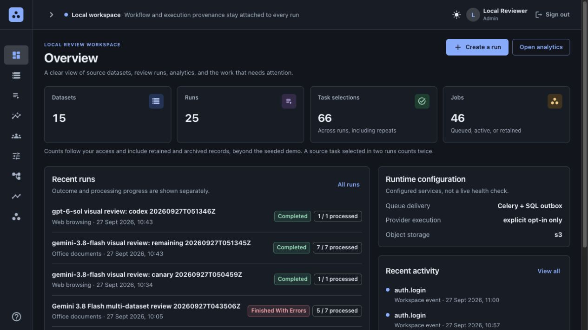
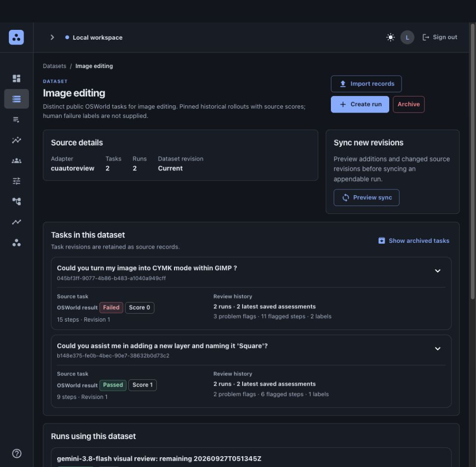
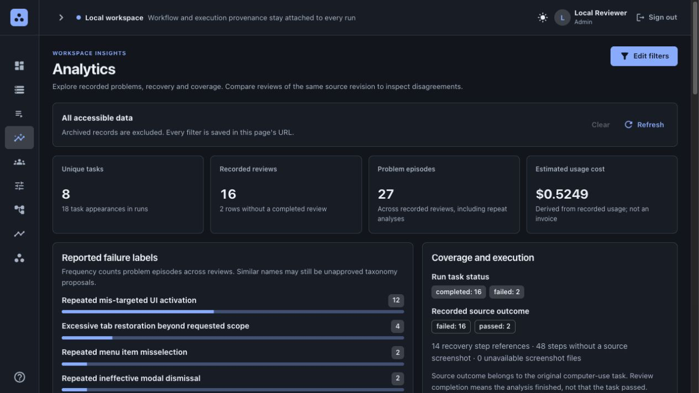
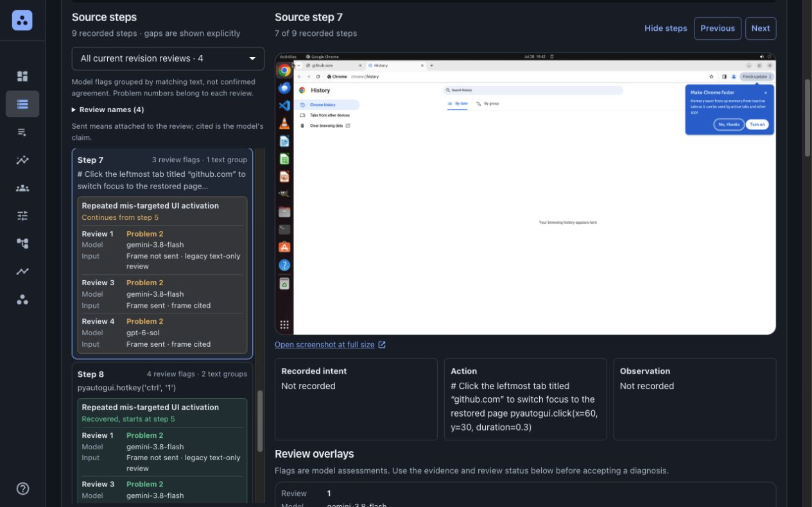
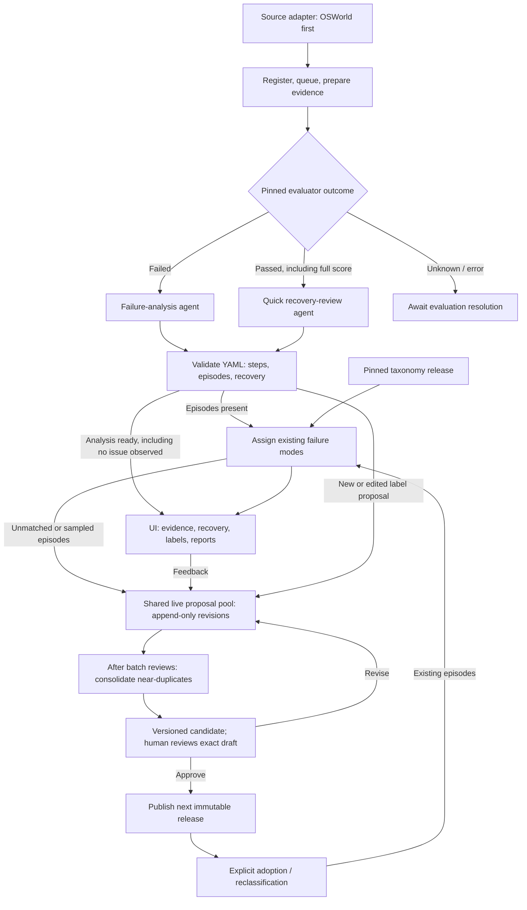

# CUAutoReview

[](https://github.com/NavpreetDevpuri/CUAutoReview/actions/workflows/ci.yml)

**Explain where computer-use agents go wrong, whether they recover, and which failure patterns recur, across failed and passing rollouts.**

A **rollout** is one attempt at a task: actions, screenshots, visible reasoning, logs and the evaluator's grade. The [original brief](reference/SWE-Assignment.md) asks for a system design. This repository contains that design, a working local platform and the POC that preceded it.

**Start here: [system design](docs/DESIGN.md).** One document covers the architecture, data model with example queries, failure clustering, taxonomy evolution, scale and cost. The [submission summary](docs/SUBMISSION.md) lists decisions, assumptions and limits in two pages.

| | What it is |
|---|---|
| **Design** | [docs/DESIGN.md](docs/DESIGN.md) is the entry point; [specs/01–11](specs/01-system-design.md) hold the full contracts |
| **Local platform** | Docker app: JSON/ZIP import, multi-dataset runs, outbox + RabbitMQ/Celery workers, trajectory viewer, analytics, same-revision comparison, taxonomy proposals with human approval. [Status](platform/README.md) |
| **POC** | Five OSWorld trajectories reviewed end to end, with parallel reviewers sharing draft labels and a final consolidation step. [Results](poc/README.md) |
| **Evidence** | Backend, POC and frontend test suites run in CI on every push; real PostgreSQL/RabbitMQ/S3 checks; 8 screenshot-enabled live reviews for **$0.367 estimated**. [Tests](platform/TEST-RESULTS.md) · [live results](platform/LIVE-RESULTS.md) |
| **Not yet proven** | Diagnosis accuracy against human adjudication, throughput at scale, production hardening. [Validation plan](reviews/HUMAN-VALIDATION.md) |

**Five decisions that shape everything else**

1. **Explain first, label later.** Each review records every step and groups mistakes into evidence-cited *episodes* before any taxonomy label is attached, so taxonomy changes never require re-reading trajectories.
2. **Review passing rollouts too.** A pass can hide mistakes the agent recovered from. Failed and passed rollouts take separate review routes with their own prompts and budgets.
3. **Let the taxonomy emerge, then version it.** Reviewers propose labels into a shared pool; a consolidation step (plus density clustering at scale) drafts candidates; only a human approval publishes an immutable release. Old results stay pinned to their release.
4. **PostgreSQL decides, the broker delivers.** A transactional outbox, leases and fenced commits make duplicate deliveries harmless. Provider rate and spend limits, not infrastructure, are the expected bottleneck.
5. **Trajectory content is untrusted.** Review agents get read-only evidence helpers, no shell or network, and credentials never enter prompts.

Demo sign-ins: the Docker quickstart below creates five users, three teams and eight distinct tasks (admin: `admin@cuautoreview.test`; passwords are generated locally and never committed). [Independent design reviews and follow-up](reviews/README.md) · [benchmark attribution and third-party notices](THIRD_PARTY_NOTICES.md).

## Run locally with Docker

Download or clone this repository and open its root folder. Requires **Docker with Compose v2**; no host Python, Node.js or model API key. The first build downloads dependencies.

```sh
docker compose -f platform/compose.yaml up --build -d --wait
docker compose -f platform/compose.yaml run --rm seed
docker compose -f platform/compose.yaml run --rm --no-deps seed --show-logins
```

- Open **[http://127.0.0.1:8000](http://127.0.0.1:8000)** and sign in using the generated admin or reviewer credentials.
- Seeding imports bundled example tasks and saved POC evidence without model calls. Repeating it preserves account identities and passwords; new model reviews are opt-in.
- Database, evidence and Docker seed credentials stay in local named volumes. Stop with `docker compose -f platform/compose.yaml down`; omit `-v` to retain them.
- [Dockerfile](platform/Dockerfile) · [Compose services](platform/compose.yaml) · [setup, roles and provider configuration](platform/README.md).
- [Fresh Docker verification](platform/evidence/docker-quickstart-verification.json): startup, all five logins, team/task access, screenshots and repeat-seed stability passed with zero model calls.



Actual full-viewport browser captures of the local platform. The overview connects workspace totals, recent runs and activity.

<details>
<summary>Dataset and task history</summary>



Task cards keep original source results, review history and related runs visible together.

</details>

<details>
<summary>Analytics</summary>



Filter datasets, runs and tasks to inspect recorded reviews and recurring problems.

</details>

<details>
<summary>Trajectory evidence and review flags</summary>



Follow source steps and screenshot evidence alongside numbered problems and their review/model attribution.

</details>

[Mobile steps](platform/screenshots/audit-mobile-flags-20260927.jpg) · [mobile evidence](platform/screenshots/mobile-evidence-20260927.png) · [review counts](platform/screenshots/task-review-summary-20260927.png). Frontend build passed; layouts checked at 320, 390, 768 and 1280px widths. This UI update made no paid model calls; backend test evidence above comes from earlier checks. The original POC remains separate below.

The sections below explain the full design target. The [local implementation guide](platform/README.md) identifies what is available now.

## How to use the platform

- **Datasets** hold source tasks. Open a task for a step sidebar, screenshot evidence and flags attributed to each run/model. Other reviews and included runs appear below.
- **Runs** review any chosen datasets or tasks. **Start analysis** first asks for the prompt workflow, harness, model, evidence limits, budget estimate and access.
- **Presets** separate prompt workflows from reusable execution settings. Model dropdowns use provider-discovered metadata; hosted settings start with a positive allowance, while replay is free.
- **Analytics** filters by dataset, run and task through a full-screen selector. Counts distinguish unique tasks, repeated reviews, problem episodes and missing evidence.
- **Compare** aligns two reviews of the same task revision. Filter history by harness/model; flag disagreements as feedback on both reviews.
- **Demo:** three datasets with **8 distinct tasks (3 + 3 + 2)**. Historical test fixtures remain under **Show archived**. The POC is preserved.
- [Navigation and run decisions](specs/11-runs-navigation-and-comparison.md) · [Recorded UX feedback](platform/UX-FEEDBACK.md).


## Starting assumptions and deliberate choices

These are our choices, not assignment requirements.

| Choice | Why |
|---|---|
| **OSWorld-Verified first** | Concrete desktop tasks, checkers and scored traces. Replaceable source adapters keep other benchmarks possible. |
| **YAML inputs and outputs** | People, agents and code can inspect evidence indexes, presets, taxonomy and step reviews. Validate types; preserve native JSON/JSONL/images. |
| **Separate failure and passing-review agents** | Failure analysis explains an unsuccessful outcome; a lighter passing review finds mistakes followed by recovery or remaining issues. Separate prompts and budgets. |
| **One logical agent per trajectory** | Shared context across sequential steps links early mistakes to later recovery. Parallelize trajectories, not agents per step. |
| **Shared compact/render helpers** | Agent and UI use the same concise views, expandable originals and explicit omissions. |
| **Recovery separate from labels** | Correcting a mistake changes its recovery status, not its failure mechanism. |
| **Immutable taxonomy versions** | Improve future definitions without rewriting old results. Every change needs human approval. |
| **LiteLLM and ACP/acpx** | The design targets bounded API agent loops and eligible Codex/Claude Code/Gemini CLI sessions. Only the adapters identified in the [platform status](platform/README.md#model-execution-and-status) are enabled in the local implementation. |
| **RabbitMQ + Celery** | Reuse durable delivery/worker tooling; PostgreSQL stores authoritative work state/results. |

[Decisions, alternatives and costs](specs/03-decisions-and-tradeoffs.md).

## Choose the review from the recorded outcome

| Evaluator outcome | Default review | Question |
|---|---|---|
| Failed | `failure_analysis` | Why did the attempt fail? Which mistakes contributed, and which were repaired? |
| Passed, including full score | `pass_recovery` | Were there intermediate mistakes? Where did recovery occur, and what remained unresolved? |
| Unknown/error | Await evaluation resolution | Is there a usable outcome to review against? |

- Both review routes are enabled, with separate versioned prompts, agent configurations, sessions and budgets. They may share a model and helpers.
- Interpret scores through the pinned evaluator; no universal numeric cutoff. Preserve the grade: a pass proves neither an error-free path nor recovery from every mistake.
- New presets adopt this policy. Historical failed-only batches stay unchanged; review old passes through explicit successor runs/backfills.

## Following one trajectory

1. **Prepare evidence:** normalize steps and create a versioned YAML index of original events, frames and outcomes.
   - Deterministic helpers compact repeated text, render frames/crops and expose step/range lookup; originals remain available.
2. **Run the selected review agent:** supply task, success criteria, initial state, grade and compact timeline.
   - Review sequentially; expand evidence when needed. Passing review uses lighter inspection, not an automatic “recovered” verdict.
   - Long traces use bounded windows/checkpoints. Restarts restore recorded context, not hidden state; multiple calls may still rebill context.
3. **Explain every step:** intent, action, observed UI, effect, assessment and evidence links, including ordinary steps.
   - Distinguish declared/inferred/unknown intent. Mark `reviewed`, `not_reviewed` or `insufficient_evidence`. Source frames belong to the trajectory; supplied frames were attached to a request; cited frames are references in the returned review. A citation is the model's claim, not independent proof it inspected or correctly interpreted an image.
4. **Reconcile the attempt:** link multi-step mistakes and repairs into episodes; revise early conclusions using later evidence.
   - Distinguish wrong plans, intent/action mismatch, tool/environment issues and evaluator disagreement. Cite support/alternatives; allow uncertainty.
5. **Validate and save:** check YAML schema, coverage and references; a trusted serializer publishes the result.
   - “No issue observed” differs from incomplete/inconclusive. Do not manufacture mistakes in clean passes.

**Illustrative step excerpt**, not a diagnosis of our examples:

```yaml
step_id: "12"
review_status: reviewed
intent:
  kind: declared
  text: "Save the rule."
  evidence_refs: [event_12]
action: "Clicked Save."
observed_ui: "Required field error; form remains open."
effect: "Save is not confirmed."
assessment: "Inspect subsequent steps for correction."
evidence_refs: [event_12, frame_12]
episode_refs: [{episode_id: "e1", role: onset}]
```

Evidence IDs resolve to exact events/frames. Full outputs cover every step plus episodes. Validated provider JSON may be serialized to YAML; YAML does not replace API protocols or PostgreSQL.

[Agent/helpers](specs/01-system-design.md) · [contracts](specs/02-data-and-contracts.md).

## Failure labels and recovery answer different questions

| Dimension | Meaning |
|---|---|
| Failure mode | Mechanism that went wrong: **family → mode → optional subtype** |
| Recovery | Whether affected state was restored, where, and with what evidence |
| Outcome contribution | Contribution to the final failed outcome; `not_applicable` for passed attempts |

- An episode can span several steps. Track recovery as `not_assessed`, `none_observed`, `partial`, `recovered` or `unknown`, with observation boundaries.
  - If step 15 fixes the field and confirms saving, link it to episode `e1`; retain the mistake and label.
  - A repair can leave damage or consume a deadline. For failed outcomes, assess contribution independently as `contributing`, `noncontributing` or `uncertain`.
- Keep recovery, severity and application separate from taxonomy. Report passing recoveries separately from failed-outcome prevalence.
- Name categories in plain language for observable behavior. Define concrete inclusion and exclusion boundaries; avoid cryptic noun piles. Step role, failure mechanism and recovery status are separate fields.

## Complete review and taxonomy workflow



- **Assignment reads released labels; curation changes them.** Unclassified episodes remain useful. Both review routes can supply evidence.
- Parallel trajectory reviewers see the approved taxonomy and latest shared draft pool. They can propose new or edited labels; every proposal remains visible as an immutable revision and cannot mutate the approved release. Conflicts and stale edits remain explicit.
- After a batch finishes, a separate consolidation agent compares near-duplicate new/edited labels and proposes canonical mappings or aliases with rationale. It preserves raw reviews/proposals and versions a candidate taxonomy. Publishing still requires human approval of the exact candidate, base release and evidence.
- **Propose add/rename/edit/merge/split/retire:** show definitions, evidence and affected results. Approval binds exact draft, evidence and base release; any change invalidates it. Feedback creates another draft, not publication or model training.
- **Visible versions:** a batch keeps `taxonomy_release: "1.2.0"` until explicitly adopting `"1.3.0"` in a new run.
  - Patch: wording; minor: additions; major: restructuring. Artifact `schema_version` is independent.
  - Retire rather than erase labels. Merges deduplicate counts; splits need reclassification. Reuse evidence unless new distinctions require inspection.
- **Optional Jev:** selected validated YAML summaries become text for routing/existing-mode matching. It cannot inspect images, replace either sequential reviewer or approve taxonomy.

## Using and operating the platform

The bullets in this section describe the broader platform design. For local implementation status and supported commands, see [platform/README.md](platform/README.md).

- **Teams and runs:** datasets hold source tasks; runs pin a selected set from one or more datasets. Legacy appendable batches retain explicit sync without resetting progress or pinned settings.
  - Admins manage people/teams, managers batches, reviewers annotations, viewers reading, curators taxonomy. Shared computation does not share access/corrections.
  - Reuse React-admin for UI; specialize synchronized steps/images, recovery links, version badges, feedback and backlog/cost views.
- **Local services:** app, general Celery worker, isolated CLI worker, PostgreSQL, RabbitMQ and SeaweedFS (pgvector is a production target). Diagram stages are jobs, not separate servers.
  - S3-compatible storage holds originals/YAML; PostgreSQL holds searchable versions/references.
  - Outbox, unique IDs, leases, bounded retries/checkpoints: save work before delivery, results before acknowledgment. Crashes may repeat charges, not authoritative publication.
  - Enforce quotas per model call and trajectory. Scale from measured queue/DB/provider limits; production broker HA uses three nodes.
- **Execution/access:** LiteLLM API loops or eligible ACP/acpx CLI sessions; API keys/service identities preferred, no inherited host login.
  - Scoped read/render helpers only; no arbitrary shell/desktop actions. Safe YAML validation, protected secrets, untrusted trajectory text.
  - Offline fixtures test plumbing; real offline review needs a local model. Jev is hosted. Cloud migration requires provisioning/data movement.
  - Optional Harbor executes new attempts separately; OSWorld desktop needs Linux KVM and a compatible agent.
- **Traceability:** report → versioned assignment → episode → step YAML → source evidence. Freeze membership/results; append corrections. Show denominators, coverage and task-balanced compatible-version comparisons.

[Platform/UI](specs/05-platform-and-workflows.md) · [deployment/queue](specs/08-local-deployment-and-queue.md) · [reuse](specs/09-open-source-reuse.md) · [harness/auth](specs/10-harnesses-and-authentication.md) · [Jev](specs/07-jev-fast-analysis.md).

## Local POC

- **Completed:** five trajectories, 69 annotated steps, separate failure/recovery prompts, three concurrent reviewers, shared draft proposals and a final consolidation agent.
  - Latest Sol run: 11 episodes reuse eight shared labels, retained as eight canonical drafts. The passing GIMP attempt includes a detected recovery. Candidate `0.1.0-draft` still needs human review. Sol took 212 seconds; 48 steps have insufficient evidence.
- **Model:** Codex `gpt-5.6-sol` at medium reasoning for all six sessions. The original POC account rejected `gpt-6-sol`; separate API-key execution is tracked in the platform guide. Earlier Luna results are preserved.
- **Measured cost:** successful five-task runs cost $0.040028 for Luna and $0.983911 for Sol, API-equivalent including five reviewers and one final consolidation. The ChatGPT charge is unavailable.

| Model | Measured five-task run | Mean per task, consolidation amortized | Scenario for 1,000 tasks | Scenario for 10,000 tasks |
|---|---:|---:|---:|---:|
| GPT-5.6 Luna | $0.040028 | $0.008006 | $8.01 | $80.06 |
| GPT-5.6 Sol | $0.983911 | $0.196782 | $196.78 | $1,967.82 |

These are historical same-workload, same-cache-ratio POC projections, not invoice, capacity or accuracy forecasts. The newer visual sample cost $0.36706550 for nine saved reviews over eleven attempts, roughly $0.0408 per saved review with failed attempts included. [Current cost scenarios and human-effort assumptions](specs/04-evaluation-and-delivery.md#capacity-and-cost) · [POC breakdown](poc/README.md#measured-cost-and-scaling-scenarios).

- **Viewer:**
  - **Task cards:** search by task name, ID or label. Cards separate “Evaluator · Passed/Failed” (or “Outcome not recorded”) from review availability. They show recorded problems, unique explicitly flagged and recovery steps, problems by label, and labeled step links. Missing review or episode data reads “Not recorded,” not zero issues.
  - **Trajectory review:** use a collapsible task/step sidebar, larger text, full-width screenshots with explanations below, stable image alignment while navigating, inline taxonomy definitions, colored category chips and IDs, numbered problem groups with first-observed/first-flagged links, separate step roles and summaries that jump to the first step or episode card. “Screen ↑” returns to the selected screenshot. The header scrolls away; missing evidence stays visibly uncertain.
  See the [viewer feedback log](poc/VIEWER-FEEDBACK.md).


Actual Chrome capture, cropped to omit browser tabs.

- **Deliberate shortcuts:** local files, SQLite draft sharing and a small worker pool; existing Codex login; no RabbitMQ, platform services, teams, approvals, LiteLLM or ACP in this POC.

[Run/view instructions](poc/README.md) · [Sol comparison](poc/RESULTS-SOL.md) · [Luna findings, failed integration attempt and cost method](poc/RESULTS.md).

## What remains to be measured

- **Evidence:** the POC extends the [two original OSWorld failures](reference/examples/README.md) to five scored tasks, including a pass. Human gold diagnoses and historical evaluator matches remain unverified. Expand beyond this small sample. [Source research](specs/06-benchmark-and-example-data.md).
- **Sizing:** 50k stored, 10k/day, 40% failed/60% passed, 25 MB each: 250 GB/day; **4,000 failure + 6,000 passing reviews/day**.
  - Earlier fixed-call costs exclude passing review and this multi-call workflow. Measure every image, context, compaction, checking and classification call.
- **Validation:** about 300 independently double-reviewed examples, split by task. Check explanation support, coverage, recovery, taxonomy fit and compact-view fidelity. Quick-review speed/accuracy remains unmeasured.
- **Open decisions:** representative data, evaluator reliability, processing permissions, retention, latency/budget and reviewer hours. Test crashes, stale approvals, helper restrictions and API/harness compatibility before runtime claims.

[Quality, cost and reliability checks](specs/04-evaluation-and-delivery.md).
