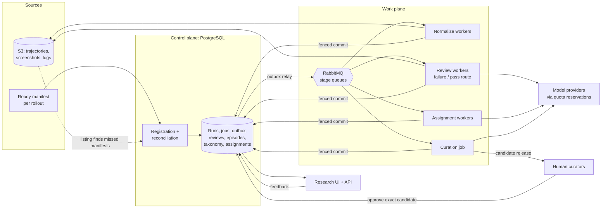
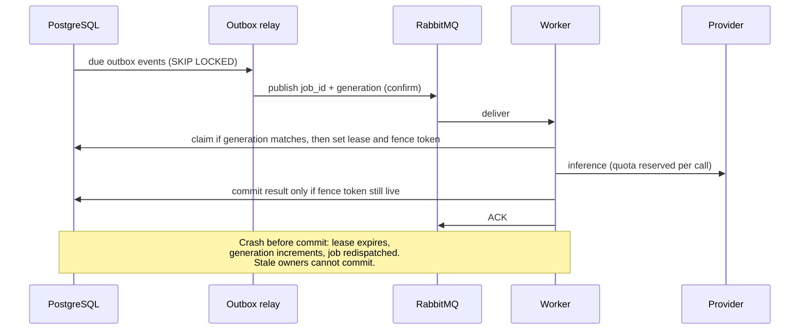
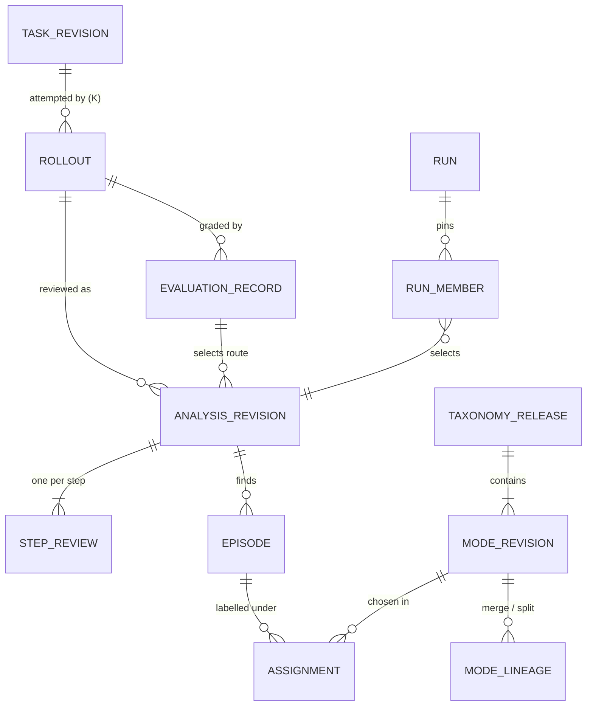

# CUAutoReview: system design

**Goal:** turn raw computer-use rollouts in S3 into evidence-backed answers to five questions: why a rollout failed, where it went wrong, whether rollouts share a failure mode, which modes are most common, and which modes are new.

This is the single entry point to the design. The [specs](specs) hold the full contracts; this document states the decisions, the data model and the numbers. Sections marked **(built)** exist in the [local platform](../platform/README.md) or [POC](../poc/README.md). Everything else is target design.

- [1. Assumptions](#1-assumptions)
- [2. Architecture](#2-architecture)
- [3. Ingestion, processing and reprocessing](#3-ingestion-processing-and-reprocessing)
- [4. Trajectory analysis: where and why](#4-trajectory-analysis-where-and-why)
- [5. Failure representation, clustering and deduplication](#5-failure-representation-clustering-and-deduplication)
- [6. Taxonomy evolution](#6-taxonomy-evolution)
- [7. Storage, schema and queries](#7-storage-schema-and-queries)
- [8. Scale, reliability and cost](#8-scale-reliability-and-cost)
- [9. Answering the five research questions](#9-answering-the-five-research-questions)
- [10. Key trade-offs](#10-key-trade-offs)
- [11. What is built and what is not](#11-what-is-built-and-what-is-not)
- [12. Glossary](#12-glossary)

## 1. Assumptions

| Assumption | Value used for sizing | Why it matters |
|---|---|---|
| Volume | 50k historical rollouts, 10k new/day, K rollouts per task | Drives queue, storage and inference sizing |
| Outcome mix | 40% failed, 60% passed | Passing rollouts are reviewed too: a pass can hide recovered mistakes |
| Size | ~5 MB JSON + ~20 MB screenshots, ~15 steps per rollout | 250 GB/day raw; screenshots dominate inference cost |
| Evaluator | Fallible; historical versions may be unknown | A grade routes review but is never treated as a diagnosis |
| First source | OSWorld-Verified (public, scored desktop traces) | Our choice for real evidence; other formats need an adapter |
| Inference | Hosted models only on approved, redacted data | Provider rate and spend limits are the expected bottleneck |

Numbers are illustrative, not requirements. Each one maps to a measurement in [section 8](#8-scale-reliability-and-cost).

## 2. Architecture



| Component | Owns | Does not own |
|---|---|---|
| **S3** | Immutable raw artifacts, derived compact views, full YAML reviews | Any mutable state |
| **PostgreSQL** | Source registry, run membership, jobs/attempts/outbox, step reviews, episodes, taxonomy releases, assignments, feedback | Bulky payloads (stored as S3 pointers + checksums) |
| **RabbitMQ + Celery** | Delivery, backpressure, worker fan-out | Job state, retry timing, idempotency (all in PostgreSQL) |
| **Review worker** | One logical review session per rollout, with read-only evidence helpers | Taxonomy definitions; it can only *propose* labels |
| **Assignment worker** | Matching episodes to one pinned taxonomy release | Rewriting diagnoses or definitions |
| **Curation job** | Clustering and consolidating proposals into a candidate release | Publishing; only a human approval publishes |

The local stack runs the same shape in Docker Compose: app, review worker, CLI review worker, PostgreSQL, RabbitMQ and SeaweedFS's S3 API **(built)**. [Deployment details](specs/08-local-deployment-and-queue.md).

## 3. Ingestion, processing and reprocessing

**Discovery.** The writer uploads artifacts, then a *ready manifest* listing every artifact with key, version and SHA-256. Object visibility alone never means a rollout is complete. Registration happens on manifest arrival, through the API or an S3 event. A periodic listing (S3 Inventory at large scale) reconciles anything missed. The canonical manifest hash is the `source_revision`; corrections name the revision they supersede.

**Admission.** One transaction writes the source revision, run membership, a unique job row and an outbox event. A broker outage therefore never loses admitted work.



**Retries.** Each job gets four attempts in total: the first plus up to three retries for retryable errors. Backoff and jitter come from the outbox, never from Celery timers. Schema-invalid output gets one bounded repair, then quarantine. Exhausted jobs dead-letter with their full error and cost history. A crash after inference can repeat a provider charge, but it cannot publish a result twice.

**Versioning.** Every result pins a *recipe hash*: code image, adapter, prompt, model, decoding settings, evidence limits, output schema and embedding model. Runs freeze their membership, so later imports never silently enter a finished experiment.

**Reprocessing.** Only the stages downstream of a change rerun:

| What changed | Reused | Reruns |
|---|---|---|
| Source correction (new `source_revision`) | Nothing for that rollout | Normalize → review → assign |
| Adapter / normalizer | Raw artifacts | Normalize → review → assign |
| Review prompt, model or evidence limits | Normalized input | Review → assign |
| Taxonomy release (new / merge / split mode) | Episodes and evidence | Assignment only, on cohorts selected for adoption |
| Definition wording only | Everything | Nothing; display resolves wording from the pinned release |
| Evaluator rescoring | Normalized input | New evaluation record; review again only if the route changes |

Backfills are explicit successor runs with a cost estimate and a separate quota share (80% live, 20% backfill as a starting point). Old runs and reports never change.

## 4. Trajectory analysis: where and why

**Route by outcome.** The pinned evaluator's result selects one review route per rollout:

| Outcome | Route | Question it answers |
|---|---|---|
| `failed` | `failure_analysis` | Which mistakes contributed to the failure, and where did they start? |
| `passed` | `pass_recovery` | Were there mistakes the agent recovered from, or unresolved issues the grader missed? |
| `unknown` / `error` | Deferred | Never guess a grade from screenshots or exit codes |

**Shared evidence view (built, partly).** Deterministic helpers normalize actions, responses and screenshots into an indexed step list. The model and the UI see the *same* view. Long logs are compacted, with omission markers and links back to the originals. Helpers are read-only: no shell, network or desktop actions. Trajectory text is treated as untrusted data, never as instructions.

**One sequential reviewer per rollout.** A single logical session reads every step in order, carrying open questions forward. Long traces are reviewed in chunks with checkpoints. For every step it emits a record (built):

```yaml
step_id: "12"
review_status: reviewed          # reviewed | not_reviewed | insufficient_evidence
intent: {kind: declared, text: "Set Rows to 5"}
action: "Typed 75 into the focused field."
observed_ui: "Columns=75, Rows=2 in the table dialog."
effect: "Columns changed instead of Rows."
assessment: "Action targeted a different field than the stated intent."
evidence_refs: [event_12, frame_12]
episode_refs: [{episode_id: ep1, role: onset}]
```

The core check is **requirement → visible intent → action → observed effect → outcome**. It separates three mechanisms that a single label would merge: a wrong plan executed correctly, a right plan executed wrongly, and a tool or environment fault. Hidden reasoning is never reconstructed. Missing intent stays `unknown`.

**Localizing the failure.** "Where" means the *earliest supported divergence*, not the first suspicious step:

1. **Forward pass:** annotate every step and flag candidate divergences, i.e. steps whose effect contradicts the requirement or the stated intent.
2. **Backward walk:** start from the evaluator's failing check (e.g. "cell B2 ≠ 42"). Walk back through the steps whose effects touched that state. Find the first step after which success needed a correction that never happened.
3. **Separate onset, manifestation and terminal symptom.** The onset is the episode's start; later visible symptoms are linked steps, not new root causes.
4. **Keep competing explanations.** If evidence cannot decide between two candidate onsets, record both with their evidence instead of picking one by position.
5. **Optional contrast:** a passing sibling rollout of the same task shows where behavior diverged. This supports a hypothesis; it does not prove causation.

**Episodes, not labels.** A rollout yields zero or more *episodes*. Each records onset and end steps, expected vs observed state, the mechanism in plain language, alternatives, origin (`agent`, `tool_env`, `evaluator`, `mixed`, `unknown`), and two independent fields:

- **Recovery:** `not_assessed`, `none_observed`, `partial`, `recovered`, `unknown`, with the correction steps cited.
- **Outcome contribution:** `contributing`, `noncontributing` or `uncertain` for failed rollouts; `not_applicable` for passed ones.

A recovered mistake can still contribute to a failure, for example through lost time or irreversible side effects. Episodes are saved *before* any taxonomy label, so a taxonomy change never requires re-reading the trajectory.

**Validation before publish.** Each review must have exactly one record per step, every reference must resolve to real evidence, and spans must be ordered. Output that cites missing evidence is rejected and retried **(built)**. Partial coverage is allowed but is always disclosed as partial. Confidence comes from calibration on adjudicated examples, never from the model's self-rating.

## 5. Failure representation, clustering and deduplication

The POC consolidated labels with an LLM over five tasks, which is enough at that size **(built)**. At scale the design adds embeddings and density clustering. Similarity only *retrieves* candidates: an evidence-checking step always makes the decision.

**Mechanism signature.** Each episode gets a short, redacted string that is embedded once:

```text
origin=agent | expected: value in target field | observed: value in adjacent field |
mechanism: click landed on a neighbouring control; no read-back before continuing
```

App names, file names, numbers and coordinates are stripped. Domain, application, agent version and severity stay as filterable *facets*, not part of the mechanism. This keeps one mode from fragmenting into a separate copy per app.

**Deduplication happens at three levels:**

| Level | Rule | Answers |
|---|---|---|
| Within a rollout | The reviewer merges multi-step symptoms into one episode; downstream symptoms link to the onset | "One mistake, five symptoms" is counted once |
| Across K rollouts of a task | Episodes of the same task revision with signature similarity ≥ τ (start at 0.85 cosine, calibrate) and onsets in the same task phase form a **sibling group**. This works before any taxonomy exists. | "3 of 5 failed rollouts of this task hit the same issue at the date-entry step" |
| Across tasks | Same assigned mode under one pinned release | "This mode affects 41 tasks across 3 domains" |

Aggregates count distinct `(rollout, mode)` pairs and report affected tasks. Discovery caps each task at two episodes per candidate cluster, so a task with large K cannot manufacture a mode.

**Assignment (fast path).** For each new episode:

1. Retrieve the top-5 modes from the pinned release by vector similarity to their definitions and exemplars.
2. A classifier prompt checks the episode's evidence against each candidate's inclusion and exclusion rules.
3. Record `assigned` (one primary plus optional contributing modes), `ambiguous` (with the competing modes), `unclassified` or `insufficient_evidence`, along with the classifier recipe and a calibrated confidence.

Automatic assignment is enabled only after measured error is ≤5% on held-out adjudicated episodes ([quality gates](specs/04-evaluation-and-delivery.md#quality-benchmark)).

**Discovery (slow path).** This runs after each run completes or daily, whichever comes first:

1. **Pool:** unclassified and ambiguous episodes, plus a 2% random sample of assigned ones to catch modes that have grown too broad.
2. **Cluster incrementally:** run HDBSCAN over the new pool members plus stored exemplars of existing clusters, not over all history. Density clustering needs no preset number of clusters and leaves outliers unclustered instead of forcing them into a mode.
3. **Promote:** a cluster spanning ≥3 distinct tasks becomes a proposal seed. Reviewer-flagged severe singletons need no minimum size.
4. **Draft:** a curation model reads 5–10 representatives (the medoid plus boundary cases). It drafts a plain-language name, a definition, inclusion and exclusion rules, examples and counterexamples, and checks for duplicates against open proposals and the current release.
5. **Approve:** a human approves, edits or rejects the exact candidate (section 6).

**Bootstrapping from nothing.** Review a stratified sample of about 300–500 rollouts across domains, agents and outcomes with an empty taxonomy. Every episode starts unclassified, and the discovery path produces release `0.1.0`. Parallel reviewers share a live draft-proposal pool so they converge on wording instead of inventing synonyms. A separate consolidation step merges near-duplicates. **(Built in the POC. The platform snapshots shared drafts when each job starts and runs consolidation on request.)**

**Cluster quality** is measured, not assumed: purity on adjudicated samples, assignment precision and recall, ambiguous rate, reviewer "wrong label" feedback rate and label churn per release.

## 6. Taxonomy evolution

**Structure.** Family → mode → optional subtype, one parent each, no cycles. A mode is a reusable *mechanism* with a plain-language name, definition, inclusion and exclusion rules, positive examples and counterexamples. Every concept has a stable `concept_id`. Each release holds an immutable `mode_revision` for every concept.

**Lifecycle.** Proposal (append-only revisions) → candidate release → human review → transactional publish → explicit adoption by a successor run. Models can draft but never publish. An approval binds the exact candidate, base release and evidence, so any later edit invalidates it.

| Change | Identity rule | Historical results | What reruns |
|---|---|---|---|
| Wording or example edit | Same `concept_id`, new `mode_revision` | Unchanged | Nothing |
| Rename, same meaning | Same `concept_id` | Unchanged; display uses the pinned release's name | Nothing |
| New mode | New `concept_id` | Older releases unaffected | Assignment for adopted cohorts |
| Merge A + B → C | New C; lineage A→C, B→C | Old counts map to C deterministically | None needed for trends |
| Split A → A1, A2 | New A1, A2; lineage A→A1, A→A2 | Old A episodes become `unresolved_under_new_taxonomy` until reassigned; never redistributed by guess | Assignment for A's episodes; re-extraction only if the distinguishing evidence was never captured |
| Reparent | Same concept, new parent edge in the new release | Parent rollups differ by release | Nothing |
| Deprecate | Concept kept, marked deprecated, optional successor | Unchanged | New assignments stop |

**When to change the taxonomy.** These signals open proposals automatically. Thresholds are starting points to calibrate.

| Signal | Starting trigger | Proposed action |
|---|---|---|
| Unclassified rate | >10% of a run's episodes, or doubling week over week | Run discovery on the pool |
| Unclassified cluster | ≥5 episodes across ≥3 distinct tasks | New mode |
| Confusion between two modes | >20% of assignments to A or B are `ambiguous` between them | Merge, or sharpen the boundary |
| Overbroad mode | Sampled members form ≥2 dense sub-clusters, or >15% "wrong label" feedback | Split |
| Dead mode | Zero assignments for 3 releases or 90 days | Deprecate |
| Reviewer flag | "New mechanism" feedback with evidence | Added to the pool directly |

**Trends across releases.** Charts resolve old concept IDs through `mode_lineage`. Merges roll up to the successor. Splits show the parent total plus an explicit *unresolved* series until reassignment finishes. A taxonomy change therefore never looks like an agent regression.

*Illustrative split:* release 1.2's "Did not verify an action's result" covers 120 failed rollouts. Feedback shows two remedies, so release 1.3 splits it into "Acted before the UI finished loading" and "Did not read back an entered value". Reassignment, which needs no review rerun, yields 70 and 38. The remaining 12 stay `ambiguous` for human review. The family total stays 120 across both releases.

## 7. Storage, schema and queries

**PostgreSQL** holds everything researchers filter and join. **S3** holds bytes, referenced by URI, version and SHA-256. Indexed metadata, scoped vector search and materialized aggregates all live in one database until measurements say otherwise.



Core tables, abridged (target design; the local platform implements a subset with JSON review artifacts):

```sql
CREATE TABLE task_revision (
  task_revision_id uuid PRIMARY KEY,
  task_id          text NOT NULL,
  revision         int  NOT NULL,
  domain           text NOT NULL,
  application      text,
  UNIQUE (task_id, revision)
);

CREATE TABLE rollout (                       -- one attempt; K per task
  rollout_id       uuid PRIMARY KEY,
  task_revision_id uuid NOT NULL REFERENCES task_revision,
  agent_version    text NOT NULL,
  source_revision  char(64) NOT NULL,        -- sha256 of canonical ready manifest
  manifest_uri     text NOT NULL,            -- s3://bucket/key?versionId=...
  step_count       int  NOT NULL
);

CREATE TABLE evaluation_record (
  evaluation_id     uuid PRIMARY KEY,
  rollout_id        uuid NOT NULL REFERENCES rollout,
  evaluator_version text,                    -- NULL when historically unknown
  outcome           text NOT NULL CHECK (outcome IN ('passed','failed','unknown','error')),
  supersedes_id     uuid REFERENCES evaluation_record
);

CREATE TABLE analysis_revision (
  analysis_revision_id uuid PRIMARY KEY,
  rollout_id       uuid NOT NULL REFERENCES rollout,
  evaluation_id    uuid NOT NULL REFERENCES evaluation_record,
  review_kind      text NOT NULL CHECK (review_kind IN ('failure_analysis','pass_recovery')),
  recipe_hash      char(64) NOT NULL,        -- prompt, model, limits, schema, code digest
  revision         int  NOT NULL DEFAULT 1,  -- human corrections append, never overwrite
  coverage         text NOT NULL,            -- complete | partial | abstained
  artifact_uri     text NOT NULL,            -- full YAML review in S3
  cost_usd         numeric(12,6),
  created_at       timestamptz NOT NULL DEFAULT now(),
  UNIQUE (rollout_id, evaluation_id, review_kind, recipe_hash, revision)
);

CREATE TABLE run_member (                    -- freezes what a report means
  run_id               uuid NOT NULL,
  rollout_id           uuid NOT NULL REFERENCES rollout,
  evaluation_id        uuid NOT NULL REFERENCES evaluation_record,
  analysis_revision_id uuid REFERENCES analysis_revision,  -- NULL while pending
  PRIMARY KEY (run_id, rollout_id)
);

CREATE TABLE step_review (
  analysis_revision_id uuid NOT NULL REFERENCES analysis_revision,
  step_index    int  NOT NULL,
  review_status text NOT NULL,               -- reviewed | not_reviewed | insufficient_evidence
  action text, observed_ui text, effect text, assessment text,
  evidence      jsonb NOT NULL,              -- [{kind, uri, sha256, pointer}]
  PRIMARY KEY (analysis_revision_id, step_index)
);

CREATE TABLE episode (
  episode_id           uuid PRIMARY KEY,
  analysis_revision_id uuid NOT NULL REFERENCES analysis_revision,
  onset_step           int  NOT NULL,
  end_step             int  NOT NULL,
  mechanism            text NOT NULL,        -- taxonomy-independent explanation
  origin               text NOT NULL,        -- agent | tool_env | evaluator | mixed | unknown
  recovery_status      text NOT NULL,
  outcome_contribution text NOT NULL,        -- contributing | noncontributing | uncertain | not_applicable
  signature_embedding  vector(1024),
  embedding_model      text
);

CREATE TABLE taxonomy_release (
  release_id   uuid PRIMARY KEY,
  version      text NOT NULL UNIQUE,         -- e.g. 1.3.0
  approved_by  uuid NOT NULL,
  published_at timestamptz NOT NULL
);

CREATE TABLE mode_revision (
  mode_revision_id  uuid PRIMARY KEY,
  release_id        uuid NOT NULL REFERENCES taxonomy_release,
  concept_id        text NOT NULL,           -- stable identity across wording edits
  parent_concept_id text,
  name text NOT NULL, definition text NOT NULL,
  rules jsonb NOT NULL,                      -- includes, excludes, examples, counterexamples
  status text NOT NULL,                      -- active | deprecated
  UNIQUE (release_id, concept_id)
);

CREATE TABLE mode_lineage (
  from_concept_id text NOT NULL,
  to_concept_id   text NOT NULL,
  relation        text NOT NULL CHECK (relation IN ('renamed','merged_into','split_into','deprecated_by')),
  release_id      uuid NOT NULL REFERENCES taxonomy_release,
  PRIMARY KEY (from_concept_id, to_concept_id, release_id)
);

CREATE TABLE assignment (
  assignment_id     uuid PRIMARY KEY,
  episode_id        uuid NOT NULL REFERENCES episode,
  release_id        uuid NOT NULL REFERENCES taxonomy_release,
  classifier_recipe char(64) NOT NULL,
  status            text NOT NULL,           -- assigned | ambiguous | unclassified | insufficient_evidence
  mode_revision_id  uuid REFERENCES mode_revision,
  role              text,                    -- primary | contributing
  confidence        real,                    -- calibrated on adjudicated examples
  decision_source   text NOT NULL            -- model | human
);
CREATE UNIQUE INDEX one_primary_per_episode
  ON assignment (episode_id, release_id, classifier_recipe) WHERE role = 'primary';
CREATE INDEX ON assignment (release_id, mode_revision_id) WHERE status = 'assigned';
CREATE INDEX ON episode USING hnsw (signature_embedding vector_cosine_ops);
```

**Query 1: top contributing failure modes by agent version and domain**, with honest denominators. The denominator counts all analyzed failed rollouts, abstentions included. The task-balanced share stops a task with many rollouts from dominating.

```sql
WITH failed AS (
  SELECT r.rollout_id, r.agent_version, t.domain, t.task_id, m.analysis_revision_id
  FROM run_member m
  JOIN rollout r           USING (rollout_id)
  JOIN task_revision t     USING (task_revision_id)
  JOIN evaluation_record e ON e.evaluation_id = m.evaluation_id
  WHERE m.run_id = :run AND e.outcome = 'failed' AND m.analysis_revision_id IS NOT NULL
),
per_task AS (
  SELECT agent_version, domain, task_id, count(*) AS n FROM failed GROUP BY 1, 2, 3
),
hits AS (                                   -- distinct (rollout, mode) pairs
  SELECT DISTINCT f.rollout_id, f.agent_version, f.domain, f.task_id, mr.concept_id, mr.name
  FROM failed f
  JOIN episode ep      ON ep.analysis_revision_id = f.analysis_revision_id
  JOIN assignment a    ON a.episode_id = ep.episode_id
                      AND a.release_id = :release AND a.status = 'assigned'
  JOIN mode_revision mr ON mr.mode_revision_id = a.mode_revision_id
  WHERE ep.outcome_contribution = 'contributing'
)
SELECT h.agent_version, h.domain, h.name,
       count(*)                                   AS failed_rollouts_with_mode,
       d.failed_rollouts,
       round(count(*)::numeric / d.failed_rollouts, 3)       AS rollout_share,
       round(sum(1.0 / p.n) / d.tasks, 3)                    AS task_balanced_share,
       count(DISTINCT h.task_id)                  AS affected_tasks
FROM hits h
JOIN per_task p USING (agent_version, domain, task_id)
JOIN (SELECT agent_version, domain, sum(n) AS failed_rollouts, count(*) AS tasks
      FROM per_task GROUP BY 1, 2) d USING (agent_version, domain)
GROUP BY h.agent_version, h.domain, h.name, d.failed_rollouts, d.tasks
ORDER BY h.agent_version, h.domain, rollout_share DESC;
```

**Query 2: from an aggregate back to evidence.** Every number in the UI drills down to the episode, its steps and their screenshot URIs.

```sql
SELECT r.rollout_id, t.task_id, ep.onset_step, ep.mechanism, ep.recovery_status,
       s.step_index, s.observed_ui, s.evidence
FROM assignment a
JOIN episode ep            USING (episode_id)
JOIN analysis_revision ar  USING (analysis_revision_id)
JOIN rollout r             USING (rollout_id)
JOIN task_revision t       USING (task_revision_id)
JOIN step_review s ON s.analysis_revision_id = ar.analysis_revision_id
                  AND s.step_index BETWEEN ep.onset_step AND ep.end_step
WHERE a.release_id = :release AND a.mode_revision_id = :mode AND a.status = 'assigned'
ORDER BY r.rollout_id, s.step_index
LIMIT 200;
```

**Query 3: is the taxonomy keeping up?** This feeds the signals in section 6.

```sql
SELECT date_trunc('week', ar.created_at) AS week,
       avg((a.status = 'unclassified')::int) AS unclassified_rate,
       avg((a.status = 'ambiguous')::int)    AS ambiguous_rate
FROM assignment a
JOIN episode ep           USING (episode_id)
JOIN analysis_revision ar USING (analysis_revision_id)
WHERE a.release_id = :release
GROUP BY 1 ORDER BY 1;
```

Reporting rules ([metric definitions](specs/04-evaluation-and-delivery.md#metrics-and-denominators)):

- Failure-mode prevalence counts only failed rollouts. Passing recovery is reported separately.
- Every rate ships with its denominator, coverage and pending count, plus the pinned run, recipe and release.
- Agent versions are compared only on matched task, environment and evaluator cohorts.

## 8. Scale, reliability and cost

**Measured inputs:**

- Single-call visual reviews took about 25–40 s each.
- Nine saved reviews over eleven attempts cost **$0.367 estimated**, or **$0.0408 per saved review** with failed attempts included ([evidence](../platform/docs/LIVE-RESULTS.md)).
- That sample is tiny and short (about 13 steps per rollout). Treat it as arithmetic, not a forecast.

| Component | 10k/day | 100k/day | 1M/day | What breaks first, and the mitigation |
|---|---|---|---|---|
| **Model providers** | ~4 concurrent calls (35 s each); ~$408/day | ~40; ~$4.1k/day | ~400; ~$41k/day | **The main bottleneck.** Central per-provider reservations for concurrency, RPM, TPM and spend; multiple providers or regions; a cheaper first pass with escalation; sampled review of passing rollouts at 100× and above |
| **Human curation** | ~3 h/day (20 candidates × 10 min) | Grows with *novelty*, not volume | Same | Clustering keeps proposals per mode, not per rollout; prioritize by recurrence × impact; cap the queue |
| **PostgreSQL writes** | ~150k step rows, ~8k episodes/day | 1.5M step rows/day | 15M step rows/day | Partition `step_review` by month at 100×. At 1M/day keep step reviews only as Parquet in S3; episodes and assignments stay in PostgreSQL |
| **Analytics scans** | Materialized aggregates | Refresh per completed run | Columnar store | Export partitioned Parquet to S3 for DuckDB, Athena or a warehouse |
| **Vector search** | pgvector HNSW | pgvector, per-release partitions | Dedicated vector index | Assignment compares against release exemplars (thousands), not all episodes |
| **Queue + outbox** | ~30k messages/day (0.35/s) | 3.5/s | 35/s | Trivial for RabbitMQ; batch relay reads; shard queues by stage only if measured |
| **S3** | 250 GB/day | 2.5 TB/day | 25 TB/day | Lifecycle tiers for raw screenshots; compact derived views keep model input small |

Concurrency is arrivals per second × call duration. The design's multi-call agent will run longer than the measured single call, so the provider column scales linearly with session length.

**Cost model per rollout:**

`review(route) + assignment + share of curation + retries + storage + human sampling`

- Review dominates.
- Assignment is a short text-only call, an order of magnitude cheaper.
- Curation is amortized per *proposal*, not per rollout.

Budgets are enforced by per-call reservations. Once a budget is reached, work is deferred or marked inconclusive, never silently downgraded to a cheaper recipe.

**Reliability:**

| Failure | Guarantee |
|---|---|
| Broker down | Admitted work waits in the outbox; nothing is lost |
| Worker crash mid-inference | Lease expires, generation increments, job redispatched; a stale worker cannot commit |
| Duplicate delivery | Claim is conditional on generation; completed jobs are no-ops |
| Provider 429 or outage | Bounded retries with backoff; reservations stop more workers from overrunning the quota |
| Poison input | One repair attempt, then quarantine with the error visible; never an infinite loop |
| Bad recipe deployed | Results are pinned to recipe hashes; roll back by selecting the previous run, since old results are untouched |

Targets: 99.9% of valid manifests registered within 24 h, and P95 manifest-to-review within 15 min for live work under healthy providers. These are proposals to validate, not measurements. [Full failure drills](specs/04-evaluation-and-delivery.md#reliability-and-operations).

## 9. Answering the five research questions

| Question | How the system answers it | Where |
|---|---|---|
| Why did the agent fail this task? | `failure_analysis` episodes: mechanism, expected vs observed state, origin and contribution, each claim cited to steps and frames | Task review page; trajectory viewer **(built)** |
| At what point did it fail? | Onset of the primary contributing episode, i.e. the earliest supported divergence, with manifestation and terminal symptom linked separately | "First observed" step anchors **(built)** |
| Do failed rollouts share a mode? | Before a taxonomy: sibling groups by mechanism signature. After: the same concept under one pinned release | Analytics label counts across tasks **(built)**; Query 1 `affected_tasks` |
| Most common modes by task, domain or agent version? | Query 1, with rollout-weighted and task-balanced shares, denominators and coverage | Analytics **(built, filtered counts)** |
| Are new modes appearing? | Unclassified and ambiguous pools, discovery clustering and the section 6 signals | Taxonomy page **(built, proposals and approval)**; Query 3 |

## 10. Key trade-offs

| Decision | Benefit | Cost | Alternative considered |
|---|---|---|---|
| Explain episodes first, label later | Taxonomy changes reuse expensive reviews | Two stages to version | Label directly: cheaper, but every taxonomy change forces a full re-review |
| One sequential reviewer per rollout | Links cause, symptom and later recovery | Long traces need chunking and checkpoints | One agent per step: parallel but loses cross-step context |
| Review passing rollouts too | Finds recovered mistakes and grader misses | Roughly 1.5× the review volume | Failed-only: cheaper, but recovery can never be measured |
| Human approval for every release | Stable, trusted definitions | Curator time | Auto-publish clusters: fast, but labels churn and trends become meaningless |
| PostgreSQL + RabbitMQ with an outbox | Transactional state with decoupled delivery | Two systems to operate | PostgreSQL-only queue is credible at 10k/day; SQS/Temporal at larger scale |
| Immutable releases and pinned runs | Reproducible trends and rollback | Reassignment cost, unresolved splits | "Always latest": simpler, but hides whether a trend reflects the agent or the analyzer |

More alternatives and when to revisit them: [decisions and trade-offs](specs/03-decisions-and-tradeoffs.md).

## 11. What is built and what is not

| Area | Status |
|---|---|
| Local platform | Workspaces, teams, roles and sharing; JSON/ZIP import with immutable task revisions; multi-dataset runs; outbox + RabbitMQ/Celery workers with fenced completion and bounded retries; trajectory viewer; analytics; same-revision comparison; taxonomy proposals with human approval; versioned migrations and a production configuration with fail-fast checks, login throttling, security headers and readiness probes. [Status](../platform/README.md) · [tests](../platform/docs/TEST-RESULTS.md) |
| POC | Five OSWorld trajectories, 69 annotated steps, separate failure and recovery prompts, three parallel reviewers sharing draft labels, final consolidation. [Results](../poc/README.md) |
| Live model evidence | 8 distinct tasks reviewed with screenshots by Gemini 3.8 Flash, plus one matched GPT-6 Sol review. [Results](../platform/docs/LIVE-RESULTS.md) |
| Not built | Continuous S3 discovery, embeddings and density clustering, automatic assignment, cross-release crosswalk charts, parent-task grouping of K rollouts, multi-call checkpointed reviewer, load testing, production HA, SSO/OIDC |
| Not yet measured | Diagnosis accuracy against human adjudication (about 300 double-reviewed rollouts planned: [worksheet](reviews/HUMAN-VALIDATION.md)), throughput, cost at scale |

## 12. Glossary

| Term | Meaning |
|---|---|
| Rollout | One attempt by an agent at a task: actions, screenshots, logs and grade |
| Ready manifest | A file written last, listing every artifact of a rollout with checksums; marks the rollout complete |
| Source revision | Hash of the canonical manifest; changes when the source is corrected |
| Review route | `failure_analysis` for failed rollouts, `pass_recovery` for passed ones |
| Step review | The per-step record: intent, action, observed UI, effect, assessment, evidence |
| Episode | One mistake, possibly spanning steps, with onset, mechanism, recovery and contribution |
| Earliest supported divergence | The first step, backed by evidence, after which success needed a correction that never happened |
| Mode / concept | A reusable failure mechanism; `concept_id` stays stable across wording edits |
| Release | An immutable, human-approved version of the taxonomy |
| Assignment | Linking an episode to modes in one release: `assigned`, `ambiguous`, `unclassified` or `insufficient_evidence` |
| Sibling group | Episodes from different rollouts of the same task that share a mechanism |
| Recipe hash | Fingerprint of everything that affects a result: code, prompt, model, limits, schema |
| Run | A frozen set of rollouts analyzed with one recipe; reports cite a run |
| Outbox | Rows written in the same transaction as the job, then relayed to the broker; prevents lost or phantom jobs |
| Lease / fence token | A time-limited claim on a job; only the current token can commit a result |
| Saved replay | Re-displaying stored reviews without new model calls (the local default) |
