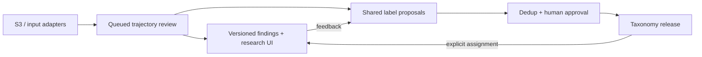

# CUAutoReview: submission summary

[Repository](https://github.com/NavpreetDevpuri/CUAutoReview) · [Full design](../README.md) · [Run locally](../platform/README.md)

**Explain where computer-use agents make mistakes, whether they recover, and which failure patterns recur.** System-design submission, supported by a preserved [five-task POC](../poc/README.md) and local platform; production readiness remains unproven.

## How it fits together

Target architecture; current boundaries below. [Component contracts](../specs/02-data-and-contracts.md).

| Replaceable component | Contract and reason |
|---|---|
| **Input adapter + evaluator** | Normalize trajectories into indexed steps/evidence; interpret scores with pinned evaluators. **OSWorld-Verified first** supplies public scored desktop traces, not an assignment requirement. Other formats need adapters. Historical evaluator versions may be unknown; grades are not diagnoses. |
| **Workflow + execution backend** | Version prompts/routing independently of harness, model, reasoning, evidence limits and budget. API/LiteLLM and native CLIs share typed step/episode/output contracts. New workflows/backends require schema, capability and conformance checks, not just configuration. |
| **YAML artifacts** | Human-, model- and code-readable indexes, presets, step reviews and taxonomy proposals/releases. Safe parsing/schema validation preserve typed contracts; retain native JSON/JSONL/logs/images through references. Readability improves; token savings are not assumed. |

## Decisions and trade-offs

- **Explain before classifying.** One logical reviewer follows requirement → visible intent → action → UI effect → outcome across the trajectory. Annotate every step with evidence references; link numbered problems to related/recovery steps. Distinguish wrong plans, action mismatches and tool/environment failures.
  - Separate failure and passing-recovery prompts; unknown/error outcomes wait. Passing does not mean mistake-free. Recovery, severity and outcome contribution remain independent of labels.
  - Separate source/supplied/cited screenshots. Missing evidence permits inconclusive results; comments/citations/grades prove neither visual effects nor recovery. Planned shared compact/render helpers retain expandable originals and omissions.
- **Let taxonomy emerge.** Cluster mechanisms, retrieve similar labels, check definitions/examples/boundaries; retain unmatched episodes. Parallel reviewers share drafts; a separate curator deduplicates new/edited labels.
  - Human approval binds the exact candidate. New/rename/merge/split/deprecate operations retain immutable releases/lineage; old results stay pinned. Explicit reclassification preserves comparisons at reviewer/backfill cost.
- **Separate evidence, state and delivery.** Validate ready manifests, register inputs and reconcile missed arrivals. S3 holds large artifacts; PostgreSQL indexes task/rollout/source revisions, run membership, steps, episodes, assignments and review attempts. Query task/domain/agent/mode/analysis/taxonomy versions; trace aggregates to evidence.
  - RabbitMQ/Celery deliver jobs; PostgreSQL retains authority through transactional outbox, idempotent claims, leases and fenced completion. Retryable failures get up to 3 retries after the initial attempt; preserve errors/costs. PostgreSQL queues remain a simpler small-scale alternative; broker operations cost more. Crashes can repeat inference charges.
- **Reuse infrastructure; specialize review UX.** Reuse FastAPI, React-admin/MUI, LiteLLM, native Codex/Gemini CLIs and SeaweedFS to focus custom code on evidence and approvals. [Reuse choices](../specs/09-open-source-reuse.md). Custom responsive UI adds aligned steps/screenshots, numbered problems, inline definitions and comparisons.
  - Admin/manager/reviewer/viewer roles, teams and individual grants support shared datasets/runs, feedback and approval; server permissions are authoritative. Docker supplies local services; S3 endpoints are configurable. AWS requires IAM, migration and compatibility checks.
- **Treat evidence as untrusted.** Restrict read/render helpers, isolate runners, keep credentials outside prompts and redact sensitive inputs before hosted inference.
- **Scale trajectories, not individual steps.** Bounded concurrency/frame selection trades latency/cost against missed evidence. Planned quotas, fair live/backfill scheduling, reconciliation and staged query/storage scaling target an illustrative 10k trajectories/day, not measured throughput. Separate failure prevalence/passing recovery; show coverage/task-balanced counts so repeated rollouts cannot dominate. [Alternatives and rationale](../specs/03-decisions-and-tradeoffs.md).

## What exists and what is proven

27 September 2026. [Implementation status](../platform/README.md) · [Verification](../platform/TEST-RESULTS.md).

| Area | Evidence and limits |
|---|---|
| **Local platform + POC** | Workspace/review features above, ZIP validation, history/analytics, bounded requests, shared drafts and explicit curation. POC tested parallel review/final consolidation. Saved replay makes no model calls. |
| **Functional checks** | Baseline: 95 tests + 2 follow-ups; real PostgreSQL/RabbitMQ/S3-compatible checks. Frontend build, 3 grouping/evidence tests; browser checks at 320/390/768/1280px. Not load or exhaustive security tests. |
| **Docker-only setup** | Fresh ARM64 stack: 5 logins, 3 teams, 8 distinct tasks, screenshot access, stable repeat seeding; no model calls. AMD64 execution unverified. [Results](../platform/docker-quickstart-verification.json). |
| **Live reviews + cost** | 8 Gemini 3.8 Flash visual reviews + 1 matched GPT-6 Sol review across 8 trajectories/11 attempts: **$0.36706550 estimated**, failed attempts included. Valid saved output is not diagnosis accuracy; invoices/total historical spend unknown. [Evidence](../platform/LIVE-RESULTS.md). |
| **Scale arithmetic** | $0.040785/saved review; **$407.85 for 10k equivalent reviews**, both routes included. Tiny mixed sample, not a forecast/load test; excludes infrastructure, classification/curation and humans. [Assumptions and staffing](../specs/04-evaluation-and-delivery.md#capacity-and-cost). |

**Boundaries:** local Task records each hold one rollout; parent-task grouping of K attempts remains planned. Only `trajectory_review@1` is available; custom workflow authoring, additional adapters/ACP, continuous S3 discovery, helper-agent loops, automatic post-run curation, production HA/security hardening and load testing remain targets. Shared drafts are snapshotted when jobs start, not continuously refreshed.

**Next validation:** two Writer sources retain 3 screenshots/15 steps each. Independently adjudicate task-separated examples for explanation accuracy/recovery precision; measure cost, quality and capacity. [Human-review worksheet](../reviews/HUMAN-VALIDATION.md) · [Opus audit and follow-up](../reviews/claude-audit-actions.md).
