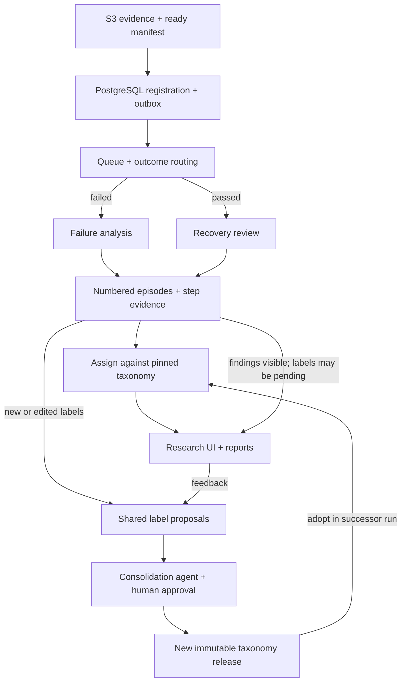

# CUAutoReview: submission summary

[Repository](https://github.com/NavpreetDevpuri/CUAutoReview) · [System design](DESIGN.md) · [Overview](../README.md) · [Run locally](../platform/README.md)

**Explain where computer-use agents make mistakes, whether they recover, and which failure patterns recur.** [System-design submission](../reference/SWE-Assignment.md), supported by a preserved [five-task POC](../poc/README.md) and local platform; production readiness remains unproven.

## How it fits together

Target architecture; unknown or error outcomes wait for resolution. Current boundaries below. [Data model, example queries, clustering and scale table](DESIGN.md) · [component contracts](../specs/02-data-and-contracts.md).

| Replaceable component | Contract and reason |
|---|---|
| **Input adapter + evaluator** | Normalize trajectories into indexed steps and evidence; interpret scores with pinned evaluators. **OSWorld-Verified first** supplies public scored desktop traces, our assumption rather than an assignment requirement. Other formats need adapters. Historical evaluator versions may be unknown; grades are not diagnoses. |
| **Workflow + execution backend** | Version prompts and routing independently of harness, model, reasoning, evidence limits and budget. Model APIs, LiteLLM and native CLIs share typed output contracts. New workflows and backends require schema, capability and conformance checks. |
| **YAML artifacts** | Human-, model- and code-readable indexes, presets, step reviews, taxonomy proposals and releases. Safe parsing and schema validation preserve typed contracts; references retain native JSON, JSONL, logs and images. Readability improves; token savings are not assumed. |

## Decisions and trade-offs

- **Explain before classifying.** One logical reviewer follows requirement → visible intent → action → UI effect → outcome. Annotate every step with evidence; link numbered problems to related and recovery steps. Distinguish wrong plans, action mismatches and tool or environment failures.
  - Separate failure and passing-recovery prompts. Passing does not mean mistake-free. Recovery, severity and outcome contribution remain independent of labels.
  - Distinguish source, supplied and cited screenshots. Comments, citations and grades prove neither visual effects nor recovery. Evidence gaps permit inconclusive reviews; preserve competing explanations and contradictory evidence. Causes remain hypotheses until replay or intervention. Planned compact/render helpers retain expandable originals and omissions.
- **Let taxonomy emerge.** Cluster mechanisms; keep application and domain as separate attributes. Assignment checks evidence against pinned label definitions, examples and boundaries. Similarity retrieves candidates; it never suffices to assign. Preserve `assigned`, `ambiguous`, `unclassified` and `insufficient_evidence` results.
  - Parallel reviewers share drafts; a separate curator deduplicates new or edited labels. Human approval binds the exact candidate. New labels, renames, merges, splits and deprecations preserve immutable releases and lineage; old results stay pinned.
  - Successor runs adopt releases explicitly. Splits leave history unresolved under the new taxonomy until reclassified, never guessed. Taxonomy-only changes usually reuse episodes; new distinctions may require re-extraction. Analysis changes rerun review and dependent stages. This preserves comparisons at reviewer and backfill cost.
- **Separate evidence, state and delivery.** Validate ready manifests, register inputs and reconcile missed arrivals. S3 holds artifacts; PostgreSQL indexes task and source revisions, rollouts, run membership, steps, episodes, assignments and attempts.
  - Query by task, domain, agent, mode and analysis/taxonomy version. Trace report → run → assignment → episode → step evidence. Report failure prevalence separately from passing recovery; disclose coverage and task-balanced counts so repeated rollouts cannot dominate.
  - RabbitMQ and Celery isolate delivery and backpressure from database authority. A transactional outbox, idempotent claims, leases and fenced completion tolerate duplicate delivery. PostgreSQL queues are a simpler small-scale alternative; a broker adds operations. Up to three retries follow the initial attempt, preserving errors and costs. Crashes can repeat inference charges; local per-attempt allowances are estimates, not hard billing caps.
- **Reuse infrastructure; specialize review UX.** FastAPI, React-admin/MUI, LiteLLM, native Codex/Gemini CLIs and SeaweedFS supply web, admin, provider and storage components. Custom code focuses on collaborative evidence review: responsive aligned steps/screenshots, numbered problems, inline definitions, comparisons and approvals. [Reuse choices](../specs/09-open-source-reuse.md).
  - Admin, manager, reviewer and viewer roles, teams and individual grants govern shared datasets and runs; server permissions are authoritative. Docker supplies local services with configurable S3 endpoints. AWS still requires IAM, migration and compatibility checks.
- **Treat evidence as untrusted.** Restrict read/render helpers, isolate runners, keep credentials outside prompts and redact sensitive inputs before hosted inference.
- **Scale within provider limits.** Parallelize trajectories; bounded concurrency and frame selection trade latency and cost against missed evidence. Provider rate and spend limits are the expected bottleneck. Planned central quotas, fair live/backfill scheduling, reconciliation and staged database/storage scaling target an illustrative 10k trajectories/day, not measured throughput. [Alternatives and rationale](../specs/03-decisions-and-tradeoffs.md).

## What exists and what is proven

27 September 2026. [Implementation status](../platform/README.md) · [Verification](../platform/TEST-RESULTS.md).

| Area | Evidence and limits |
|---|---|
| **Local platform + POC** | Access controls, validated imports, runs, trajectory viewer, history, analytics, shared drafts and explicit curation. One bounded request per trajectory with up to 32 selected screenshots and recorded coverage. POC tested parallel review and final consolidation. Saved replay makes no model calls. |
| **Functional checks** | CI runs 121 backend, 27 POC and 10 frontend tests plus the production build on every push, and an amd64 Docker quickstart check. Earlier real PostgreSQL, RabbitMQ and S3-compatible checks; a headless-browser pass over 14 routes as reviewer and admin; browser widths 320, 390, 768 and 1280px. No load or exhaustive security tests. [Latest results](../platform/TEST-RESULTS.md#code-review-hardening-3-october-2026). |
| **Docker-only setup** | Fresh ARM64 stack: 5 logins, 3 teams, 8 distinct tasks, screenshot access, stable repeat seeding; no model calls. CI repeats the same build, double seed and verification on amd64 for every push. [Results](../platform/evidence/docker-quickstart-verification.json) · [workflow](../.github/workflows/ci.yml). |
| **Live reviews + cost** | 8 Gemini 3.8 Flash visual reviews + 1 matched GPT-6 Sol review across 8 trajectories/11 attempts: **$0.36706550 estimated**, failed attempts included. Valid saved output is not diagnosis accuracy; invoices/total historical spend unknown. [Evidence](../platform/LIVE-RESULTS.md). |
| **Scale arithmetic** | $0.040785/saved review; **$407.85 for 10k equivalent reviews**, both routes included. Tiny mixed sample, not a forecast/load test; excludes infrastructure, classification/curation and humans. [Assumptions and staffing](../specs/04-evaluation-and-delivery.md#capacity-and-cost). |

**Boundaries:** local Task records each hold one rollout; parent-task grouping of K attempts remains planned. Only `trajectory_review@1` is available; custom workflow authoring, additional adapters/ACP, continuous S3 discovery, helper-agent loops, automatic post-run curation, production HA/security hardening and load testing remain targets. Shared drafts are snapshotted when jobs start, not continuously refreshed.

**Next validation:** two Writer tasks have only three screenshots for fifteen steps each, limiting visual claims. Independently adjudicate task-separated examples for explanation accuracy and recovery precision; measure cost, quality and capacity. [Human-review worksheet](../reviews/HUMAN-VALIDATION.md) · [Opus reviews and follow-up](../reviews/README.md).
