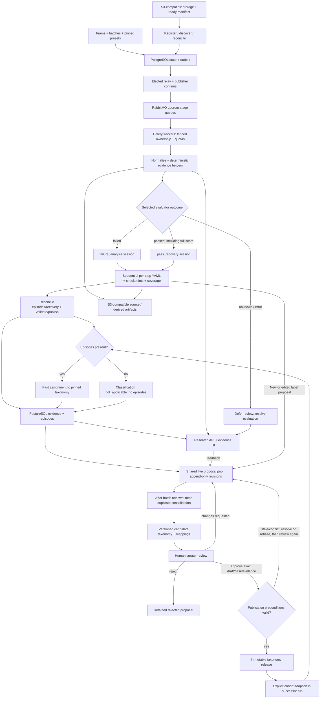

# 1. System design

This document describes the broader system design, not a statement that every component is available locally. Core workspace workflows are implemented in the local platform; integration and production status are tracked in [platform/README.md](../../platform/README.md) and [platform/TEST-RESULTS.md](../../platform/docs/TEST-RESULTS.md).

## Goal and starting assumptions

Explain **where and why computer-use agents make mistakes**, including mistakes recovered during successful attempts. Group recurring mechanisms, discover new modes and trace every aggregate to a versioned rollout and evidence.

- **Initial source:** OSWorld-Verified actions, screenshots, task definitions and evaluator results. This is a design choice, not an assignment mandate. Preserve unknown historical versions; add other source adapters later.
- **Identity:** one task definition can have K independent rollout attempts; each attempt can have corrected source revisions. The local UI currently calls one imported rollout record a **Task** and has no parent-task grouping across attempts. Import independent attempts as separate records, never as corrections to one record. [Local vocabulary and limits](11-runs-navigation-and-comparison.md#mental-model).
- **Platform:** admins/teams, appendable dataset batches, asynchronous review and trajectory inspection. Optional external runners can supply missing attempts. Automatic agent repair, arbitrary-code workflow builders and foundation-model training remain outside scope. [Platform contracts](05-platform-and-workflows.md).
- **Assumptions to validate:** stable task/rollout IDs and completion manifests; fallible evaluators; possibly missing screenshots; external inference only for approved, redacted data. Illustrative load: **50,000 historical and 10,000 new rollouts/day**, not assignment requirements.
- **Principles:** evidence before labels; explicit uncertainty; immutable inputs/results; one sequential review session with bounded context and visible coverage; established storage, broker and worker components, expanded only for measured bottlenecks.

## Architecture and routing



- **Local:** six Compose services: app, Celery worker, isolated CLI review worker, PostgreSQL, RabbitMQ and SeaweedFS. pgvector is a production target; the local stack has no embeddings yet. App/worker share a Python image; storage uses the S3 API. Database boxes above are logical roles in one database.
- **Production:** three-node broker, independently scaled workers, managed PostgreSQL and AWS S3. The app's elected loop relays committed outbox events. [Deployment details](08-local-deployment-and-queue.md).
- **Batches:** scoped admission/progress/grants over shared stage queues, with workspace quotas and fair scheduling. No physical queue or broker per batch. New arrivals use pinned configuration and new sync waves without resetting work.

### Intake and durable work

1. Upload objects, then a ready manifest with versions/checksums and expected artifacts. Object visibility alone does not prove bundle completeness. Register through the app or discover by listing; notifications can accelerate this later.
2. Import historical bundles using listing plus task metadata, optionally S3 Inventory at larger AWS scale. Verify bundles; leave ambiguous/unfinished ones incomplete. Filenames alone do not establish identity.
3. Atomically register immutable source revision, membership, unique jobs and outbox events. Confirmed publication feeds RabbitMQ; consumers claim the delivered job ID/generation. Reconcile missing manifests; expired-lease recovery fences old ownership and redispatches.
4. Normalize → route review → validate/publish episodes → assign labels; curate asynchronously. Taxonomy changes rerun assignment; review-method changes rerun review and descendants. Reuse normalized inputs and compatible caches.
5. Use bounded exponential backoff, jitter and retry budgets; quarantine schema failures and dead-letter exhausted work. Retries preserve job identity/audit. ACK only after fenced database commit; reserve quotas in short transactions. The outbox scheduler alone times retries. Execution and inference charges can repeat after crashes; authoritative publication cannot. [Exact contracts](02-data-and-contracts.md).

### Separate review, assignment and curation

| Role | Contract |
|---|---|
| Trajectory reviewer | One logical session per trajectory and selected route; sequential annotations and evidence-backed episode/recovery reconciliation; may append a new/edited-label proposal to the shared pool, never change the approved release |
| Fast assignment | Match validated episodes to a pinned release; cannot rewrite diagnosis or definitions |
| Background curator | After the batch reviews finish, consolidate near-duplicate proposals and draft scoped definition/hierarchy changes and impact previews; cannot approve or publish |

These use separate jobs, schemas, sessions, budgets and recipe versions, although models/providers may overlap. The live pool exposes append-only proposal revisions while reviews run; the separate consolidation job starts after batch reviews complete. Several model calls or resumptions can continue one review; neither an independent agent per step nor both review routes run automatically. Jev may assist routing/assignment; pixel inspection needs an image-capable model. Publish explanations with `assignment_pending` when episodes need labels; an empty taxonomy yields unclassified episodes. Zero episodes bypass classification with `classification_status: not_applicable`, reason `no_episodes`, without fake assignments. Curation never blocks review publication.

| Selected outcome | Default route and prompt example |
|---|---|
| `failed` | **`failure_analysis`**, enabled. “Review every step in order. Explain supported mistakes and their contribution to the failed outcome; trace later recovery, alternatives and evaluator disagreement. Cite evidence and mark gaps.” |
| `passed`, including full score | **`pass_recovery`**, enabled with its own quick-review prompt/agent recipe/session/budget. “Read all compact steps. Find supported error-and-correction pairs; expand frames and long gaps to verify restoration. Record unresolved mistakes or evaluator concerns without changing the pass.” |
| `unknown` / `error` | Defer until evaluation resolves; never guess a grade from screenshots or CLI exit status. |

Pin `review_kind`, prompt/agent recipe and budgets in configuration, identities and artifacts. The pass reviewer may escalate within its route; a pass proves neither recovery nor absence of mistakes. Empty episodes are valid with explicit coverage: `no_issue_observed` is not an error-free guarantee. Missing evidence may instead require partial/inconclusive output or abstention; empty episodes alone cannot imply no issue. Existing batches keep their snapshots; enabling this policy creates a successor run with explicit membership. Historical passes are not retroactively reviewed.

## Review a trajectory

### 1. Build a shared evidence view

- Normalize actions, responses, timestamps and state. Align pre/post screenshots using sequence/request IDs; timestamps alone imply uncertain alignment. Keep original JSON/images and source pointers; bulky steps stay in S3 behind a compact index.
- Versioned deterministic helpers serve the **same canonical view to agent and UI**: compact text, actions/responses, thumbnails/crops and expandable detail. Deduplicate repetition and bound logs, retaining source versions/pointers, omission markers and read-only expansion references. Compaction neither replaces originals nor proves omitted evidence was reviewed.
- Allow only authorized typed **read/render step, range, frame and source-detail helpers**. No arbitrary shell, filesystem-write, network or computer-action tools. Helpers are bounded, read-only and never execute trajectory text. A trusted serializer validates/persists YAML. An API orchestrator may supply rendered inputs; harnesses enforce the same restrictions.
- Compare **requirement → visible intent → issued action → execution evidence → effect → grade**. Cite requirements/declared plans. Inferred intent is a tentative hypothesis; unsupported intent stays unknown. Never reconstruct hidden reasoning. Proposed action text is not an invocation; an acknowledgment is not proof of state change. Preserve recorded evaluator outcome/version: neither pass nor failure alone establishes the mechanism.

### 2. Review sequentially with bounded context

- Start with task/success criteria, grade, source/coverage manifest and available initial observation. Read every compact step in order, carrying observations/open questions. Cheap checks highlight errors, repeated actions and constraints without replacing the pass through all steps. Pass recovery targets error/correction pairs, expanding images or long gaps when needed.
- Emit compact YAML for **every normalized step**, including ordinary/recovery steps. This fictional excerpt records evidence-backed findings, not hidden reasoning:

```yaml
step_id: "43"
review_status: reviewed
intent: {kind: unknown, text: null, evidence_refs: []}
action: "Save click recorded."
observed_ui: 'Form remains open with "Required field" message.'
effect: "Save is not confirmed."
assessment: "Inspect later steps for correction."
evidence_refs: [event_43, frame_43]
episode_refs: [{episode_id: "e1", role: onset}]
```

- Coverage is **`reviewed`, `not_reviewed`, or `insufficient_evidence`** for each step; counts equal the indexed step count. Reviewed means supplied evidence and annotation were reviewed/validated, not all modalities existed or the action succeeded. Record actual text/frames/expansions; essential missing evidence yields insufficient evidence, while limits/interruption leave reasoned not-reviewed placeholders. [Complete schema](02-data-and-contracts.md).
- For long trajectories, use overlapping chunks and checkpoints containing validated annotations, cursor/coverage, source/recipe/session IDs, evidence-linked open hypotheses, pending checks and episode state. Resume logical review; reopen originals when later evidence changes an interpretation. Summaries aid navigation, never replace evidence. A provider restart may create a new session without preserving hidden context; retain logical identity and prevent duplicate publication.
- Inspect images when state is visual, text insufficient or sources conflict. Illustrative failure-route starting limits for the multi-call design remain **12k input tokens per initial context, 8 frames expandable to 24**, bounded by total rollout spend. The implemented single-request reviewer instead sends up to 32 evenly selected frames (`max_images`, 0–32). Pin pass-route limits separately. Limits may require continuation, partial coverage or abstention. Audit broader stratified samples for compaction/frame-selection misses. Reused context does **not guarantee lower billed tokens/cost**; measure calls, repeated context, checkpoints, expansions and caching.

### 3. Reconcile episodes and recovery

Compare provisional findings against later steps, terminal observations and evaluator evidence. Merge multi-step mistakes; link precursors, consequences and corrections; revise earlier annotations explicitly. Locate the **earliest supported divergence**, not the earliest suspicion. Missing later evidence proves neither recovery nor persistent damage.

Store task/plan, intent/action, action/effect and grade/evidence comparisons as **consistent/conflicting/unknown**, with support, contradictions and coverage. These are checks, not a fixed taxonomy:

| Pattern | Evidence and limit |
|---|---|
| Intent/action mismatch | Real table fixture: intended Rows=5, observed Columns=75/Rows=2. Investigate focus/targeting and later correction; comments do not prove state or hidden reasoning. |
| Wrong plan correctly executed | Fictional preserve-original task; recorded overwrite plan, action and saved-file evidence confirm overwrite. Without a recorded plan, report the conflicting action choice. |
| Tool/harness failure | Valid command rejected with `session_closed` before execution; closure cause may remain unknown. Bad agent arguments require different attribution. |
| Environment change | Timestamped modal appears between selection and click. Distinguish changed state from bad coordinates; observable recovery opportunities affect contribution. No automatic agent exemption. |
| Evaluator disagreement | Requirement met, but checker reads stale artifact. Compare artifact/checker versions/timing; preserve grade and flag conflict. |

Authorized, explicitly supplied successful controls can contrast task/environment-matched behavior. Different valid strategies are not mistakes; contrast supports hypotheses, not causation.

Episodes record symptom, intervals, supported onset, expected/observed state, mechanism, alternatives, origin, impact and uncertainty. Cite every material claim and causal link. Agent, tool/environment, evaluator, mixed and unknown origins remain distinct. Choose a primary episode only when supported; downstream symptoms are not automatically separate root causes.

| Independent field | Meaning |
|---|---|
| Recovery | `not_assessed`, `none_observed`, `partial`, `recovered`, `unknown`; cite correction steps, restored scope, before/after evidence and assessed boundary. None observed differs from insufficient evidence. |
| Outcome contribution | Failed records: `contributing`, `noncontributing`, `uncertain` with evidence/rationale. Passed records: **`not_applicable`**; retain time, cost, side effects and other impacts separately. |

**Recovery example:** wrong-field edits span steps 5–7; step 10 visibly restores the correct value. Link recovery to the same episode/mode; do not erase the mistake or invent a recovered-error mode. In a failed attempt, supported absence of residual effects can make it noncontributing; a documented missed deadline or downstream damage can leave a recovered episode contributing. Otherwise use uncertain. In the real table fixture, Columns=75 becomes 7, but Rows remains 2: partial correction without supported task completion. A passing grade alone would not settle that recovery assessment.

### 4. Validate and publish

- Validate schemas, full step-ID accounting, references, temporal spans, recovery links and claim support. Record gaps/truncation. Partial review or abstention can complete processing but cannot claim whole-trajectory coverage.
- Independently check ambiguous/high-impact claims where useful; shared-model agreement is not proof. Calibrate confidence on reviewed examples, not self-ratings. Publish alternatives or abstain when evidence cannot decide.
- Preserve disputed grades. Observational causality remains a hypothesis; replay/intervention is separate validation. Review readiness, assignment and curation progress stay independent.

## Build and evolve a taxonomy

A **mode** describes a reusable mechanism with boundaries, positive examples, counterexamples and evidence expectations. Give it a plain-language name for observable behavior, then define concrete inclusion and exclusion rules. Avoid cryptic noun piles such as “intended-control activation miss.” Episodes can span steps and recover later. Step role, failure category, recovery, contribution, severity, domain, application, agent version and origin are independent fields. “Continued without verifying a state transition” is illustrative, not a mandated label.

- Use reviewed **family → mode → optional subtype**, one parent, no cycles. Group by mechanism, not every application/severity. Optional contributing-mode assignments express overlap. Parent counts deduplicate episodes/rollouts.
- Bootstrap across tasks/domains/agents/outcomes, including both review routes. Embed canonical mechanisms with sensitive/task-specific strings removed; use vector neighbors and density clustering. Review representative, boundary and contradictory cases before naming modes.
- Assignment retrieves released candidates, checks definition/evidence fit against the exact episode revision, and records candidate/chosen IDs, support, boundary conflicts, recipe/release. Similarity alone is insufficient. Allow one primary mode plus optional contributing modes; distinguish `assigned`, `ambiguous`, `unclassified` and `insufficient_evidence`. Automatic assignment requires quality/calibration gates; poor fit queues a proposal, never edits a release.
- Keep independent attempt identities even when computation is reusable. Weight distinct tasks and cap repeated examples per task so large K cannot dominate discovery.
- Periodically inspect unclassified, low-confidence and sampled assigned episodes for hidden overbroad modes. Prioritize recurrence across tasks, impact and novelty; rare severe cases need no minimum cluster size. Bound proposals by reviewer capacity and track backlog age.

### Shared proposal pool and consolidation

- Parallel trajectory reviews read the approved taxonomy and the latest shared draft-proposal pool. Reviewers can propose new labels or edits to existing labels; each proposal is an immutable, evidence-linked revision visible to other reviewers as it arrives. This shared visibility never changes the approved release.
- Conflicting edits or stale bases remain visible as separate revisions. They do not overwrite one another; consolidation must explicitly resolve or rebase them.
- After all reviews in the batch finish, a separate consolidation/dedup agent compares proposed new and edited labels for near-duplicates. It can recommend canonical labels, mappings or aliases with evidence and rationale, while preserving every raw review and proposal.
- Consolidation produces a versioned candidate taxonomy for review. Only a human's approval of that exact candidate, base release and evidence can publish a new immutable release. A provisional POC candidate or label display is not production publication.

### Review changes without rewriting history

1. **Draft:** rename, description/boundary change, new, merge, split, reparent or deprecate. Pin base release, episode/assignment revisions, curation recipe and feedback. Show before/after definitions/hierarchy, rationale, positive/boundary/counterexamples, overlap, cohorts, count impact and reclassification cost/coverage.
2. **Review:** curator approves, comments/requests changes, edits or rejects. Keep prior drafts/feedback. Every edit, including wording, requires exact-revision human approval; editing approved content invalidates it. Unresolved comments block approval. Check evidence, boundaries/duplicates, cycles, protected-example visibility, semantic-version impact and reclassification preview.
3. **Publish transactionally:** verify authorization, approval, reviewed evidence preconditions and unchanged registry head/base. Concurrent releases or superseded/disputed supporting findings require rebase/recomputed assignments and fresh review. Publish immutable release/audit; no approval transfers to changed content/dependencies.
4. **Preserve identity:** wording retains concept ID with a new definition revision; semantic changes create successors and never reuse historical IDs. Keep raw model reviews immutable. The viewer resolves presentation names and definitions from the pinned taxonomy revision, while raw review text remains available as recorded. Retain merge/split lineage and deprecated concepts; pin membership/parent edges to reconstruct old hierarchies.
5. **Adopt explicitly:** successor runs reclassify selected cohorts, selectively re-extract missing distinctions, show pending/unresolved coverage and validate before selection. Publication never changes active batches/reports. Historical reports retain their release. Mark normalized merge views and deduplicate; a split needs reclassification or `unresolved_under_new_taxonomy`, never guessed redistribution.

UI feedback cites a particular claim/interval, assignment or definition. Route diagnosis errors to analysis drafts, label errors to assignment drafts, and naming/scope errors to curation. Humans accept corrections within authorized batch/curator scope; other batches need explicit selection. Versioned drafts/diffs refine artifacts/configuration, not model weights.

## Inspect and compare results

- UI: workspace/teams, datasets/batches, progress, overview, timeline, related episodes and taxonomy review. In the trajectory viewer, let the document header scroll away; combine task and step selection in one collapsible sidebar; use compact, readable typography (14px platform body text); show each screenshot at full content width with explanations below it; and keep the selected screenshot at a consistent vertical position during step navigation. Use self-explanatory names, consistently colored category chips and IDs, and definitions that are always visible inline. When a step links to multiple problems, show a separate numbered group for each link, with an independent step role within each group. Count linked problems rather than new mistakes, and provide a compact multi-problem summary with jumps to episode cards. See the [platform feedback](../../platform/docs/UX-FEEDBACK.md) and [preserved POC feedback](../../poc/docs/VIEWER-FEEDBACK.md).
- Keep the same task-local problem number across onset, related and recovery groups; assign each problem linked to a shared step its own role. Version 2 shows an explicit first-observed anchor, while legacy runs derive a display-only first-flagged anchor from their earliest explicit onset ID in source-trace order. Related and recovery groups link back to that anchor. Preserve `episode_id`, `onset_step_ids` and `step.episode_refs`; never infer intermediate mistake steps.
- Use “First flagged here” / “Also flagged here” for legacy onset links, “First observed here” / “Also observed here” for version 2, plus “Recovery step” and “Related step.” Show the matching first anchor as a step link. Keep role, failure category and recovery distinct. Missing evidence stays uncertain. Resolve display wording from the pinned taxonomy while preserving raw outputs and historical IDs, with a “Recorded label” disclosure for the original label. The “Screen ↑” toolbar shortcut returns to the selected screenshot.
- Resolve displayed names and definitions from the taxonomy revision. Preserve raw model output, historical review text and label IDs; show raw artifacts as recorded.
- Filter independently by review kind, recovery, contribution, hierarchy, severity, batch/wave, task/version, domain, agent/evaluator, date and analysis/taxonomy versions. Navigate aggregate → episode → step/image.
- PostgreSQL serves indexed metadata/evidence/assignments and scoped vector search; S3 holds bulky artifacts. Use materialized aggregates before a warehouse. Redacted search inherits access; an evidence proxy rechecks permissions on new screenshot requests.
- Reports pin versions, analyzed denominators, pending/incomplete coverage and sampling. Failure prevalence remains **failed-only**; report pass recovery separately. Show rollout-weighted and task-balanced results; K/multiple labels distort rankings. Match task/environment/evaluator cohorts or disclose differences. [Metrics and gates](04-evaluation-and-delivery.md).
