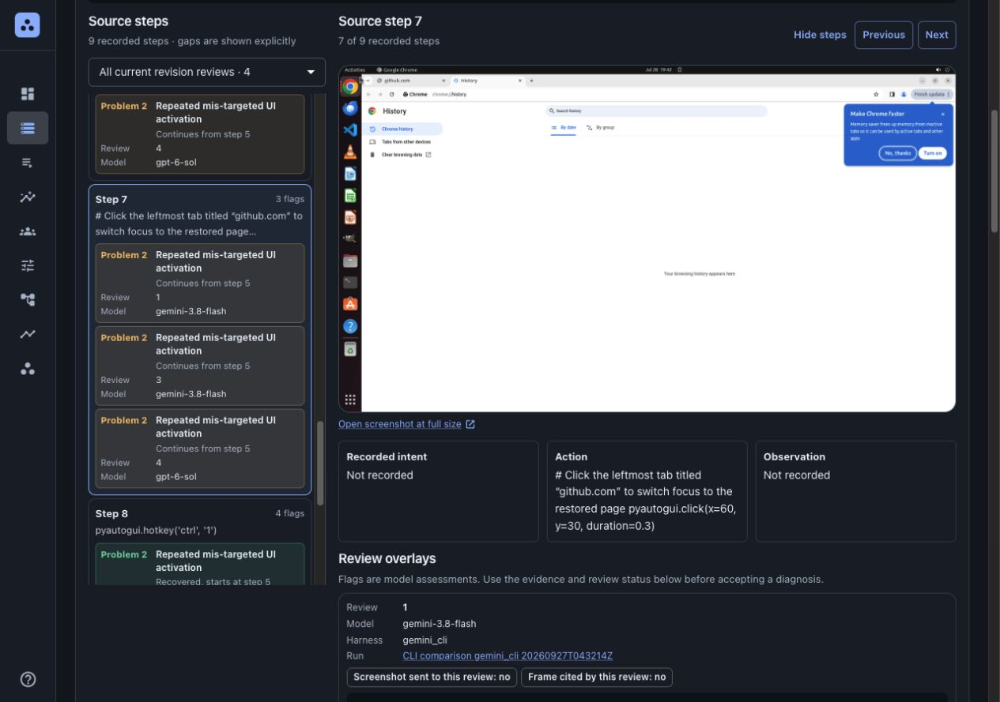

# Local platform

This directory contains the local workspace implementation, separate from the original POC. The platform is a working local application with verified core workflows. It does not implement every production workflow in the system design.

## Start the local stack

From the repository root:

```sh
docker compose -f platform/compose.yaml up --build -d --wait
docker compose -f platform/compose.yaml run --rm seed
docker compose -f platform/compose.yaml run --rm --no-deps seed --show-logins
```

Requires Docker with Compose v2, with no host Python, Node.js or API key. The first build downloads dependencies. Open [http://127.0.0.1:8000](http://127.0.0.1:8000) and sign in with the displayed credentials. The optional `seed` tool creates five accounts, three teams and imports eight distinct bundled tasks without model calls. First signup also preserves the saved POC examples. Alternatively, skip the seed and create the first account manually to initialize an empty workspace admin.

Stop with `docker compose -f platform/compose.yaml down`; named volumes retain database, broker, object data and generated demo credentials. Add `-v` only to discard those volumes. [Dockerfile](Dockerfile) builds the frontend, backend and reviewer CLIs, including the matching ARM64 or AMD64 Codex binary. [Compose](compose.yaml) handles service readiness; `seed` is an explicit one-off tool, not a service started automatically.

If Docker reports `no space left on device` during a build, free unused build cache in Docker Desktop and retry. This occurred during local validation; the application data volumes were retained.

Validated on a separate fresh ARM64 Docker stack: all five logins, three teams, eight distinct tasks, authorized screenshots, zero review jobs and a repeat seed with unchanged identities/passwords/revisions. [Results](docker-quickstart-verification.json) · [verification script](scripts/verify_docker_quickstart.py). The separate five-task POC remains available. AMD64 package selection is supported but was not executed in this check.

The Compose stack runs FastAPI and the built React-admin/MUI UI, a Celery worker, PostgreSQL, RabbitMQ and SeaweedFS with its S3-compatible API. Compose binds the application to loopback. The retained POC has its own run instructions and uses port 8765: [POC README](../poc/README.md).

## Seed demo accounts

**Recorded demo workspace:** five accounts, three teams and three datasets containing **eight distinct tasks (3 + 3 + 2)**. Screenshots and verification reports describe that local workspace. A fresh clone creates accounts with the seed command below; [dataset import steps](#datasets-runs-and-comparisons) recreate the eight-task catalog. Older local test fixtures and retained POC history remain under **Show archived** when present.

| Email | Workspace role | Demo team / batch access |
|---|---|---|
| `admin@cuautoreview.test` | Admin | All workspace controls, users and taxonomy approval |
| `manager@cuautoreview.test` | Manager | Demo Coordinators; manage datasets and batches |
| `reviewer@cuautoreview.test` | Reviewer | Demo Reviewers; inspect, give feedback and propose labels |
| `reviewer2@cuautoreview.test` | Reviewer | Demo Reviewers; second collaborator |
| `viewer@cuautoreview.test` | Viewer | Demo Observers; read and export the example batch |

- Docker users: run `docker compose -f platform/compose.yaml run --rm --no-deps seed --show-logins`. This reads existing credentials without reseeding. In the [app](http://127.0.0.1:8000), **Sign out** if needed, then **Sign in**; do not create the same account again.
- Passwords are generated once and stored with owner-only permissions in the `demo-seed-data` Docker volume. Host Python seeding instead uses ignored `platform/.local/demo-accounts.json` and `.md`. These are separate credential stores; reuse the original store when reseeding an existing database.
- The existing tasks, preset and draft taxonomy are reused. Acceptance fixtures and saved reviews stay intact; seeding starts no model jobs.

Optional host Python alternative for an existing locally seeded workspace, from the repository root:

```sh
python3 platform/scripts/seed_demo.py
```

- Reruns reuse identities and passwords, restore missing demo memberships/grants, and remove no data. Changed account roles and unrelated email collisions stop the seed instead of being overwritten.
- Empty workspace: creates the first admin. Existing workspace: uses the local test admin; otherwise pass `--admin-credentials /path/to/admin.json` containing an existing admin's `email` and `password`. A previously seeded demo admin can also bootstrap a rerun.
- Verified: five logins, role boundaries, evidence/export access, team grants and repeat-run stability. [Seven seed checks](demo-verification.json) passed with zero model calls. [Populated teams in the browser](screenshots/demo-teams.png).

## Implemented local workflows

- Cookie-based signup/login, workspace users and teams, dataset/run grants, searchable people and teams, workspace dataset visibility, and server-side access checks.
- JSON and validated ZIP task imports with immutable task revisions; ZIP manifests can reference bounded PNG, JPEG and WebP screenshot evidence. New runs pin selected tasks from one or more datasets and separate workflow/execution snapshots. Legacy appendable batches retain explicit idempotent sync.
- Saved replay of retained reviews, SQL outbox and RabbitMQ/Celery processing, recorded review history, usage and status, and S3-compatible review-result storage. Bundled source screenshots remain read-only files with recorded checksums.
- Dataset → Task → Reviews navigation, single-task analysis, configurable successor runs, exports and soft archive/restore.
- Full-screen analytics filters, same-task/revision comparison, harness/model history filters, and disagreement feedback on both results.
- Taxonomy proposals, appended feedback/revisions, candidate review and explicit admin approval or rejection.
- Screenshot evidence links and a trajectory/problem viewer. Missing evidence stays visible as missing rather than inferred from an arbitrary path.
- Light/dark appearance with a browser-persisted preference, plus in-app Markdown guides for roles, teams, datasets, ZIP imports, batches, trajectories and taxonomy.

Current verification passed: 95 automated tests, five real-service ZIP checks and four batch-completion checks. Earlier evidence covers 11 real-service scenarios with five saved trajectories, four broker lifecycle checks and seven demo-seed checks. See [acceptance scenarios](ACCEPTANCE.md) and [test results](TEST-RESULTS.md). A checklist is not proof that a scenario passed. The local stack does not provide production HA, identity integrations, independently measured review quality, or capacity guarantees.

## Datasets, runs and comparisons

- **Dataset → Task → Reviews** keeps source revisions separate from repeated analysis. Click whole cards or open links in a new tab.
- **New run** opens configuration: choose full datasets or individual tasks, inspect the prompt workflow, then choose harness, model, reasoning, evidence limits, estimated budget and access.
- **Task viewer** aligns problem number, step relationship, label, review and model in separate compact rows beside the screenshot. Phones use **All steps** to open a full-screen picker. Inspect one review or all reviews of the same source revision; other history stays below.
- Image provenance distinguishes source screenshots, those actually supplied to a model request, omitted frames and frame citations in the returned review. A model citation is not independent proof that the image was inspected or interpreted correctly.
- **Model dropdowns** list a workspace's provider metadata snapshot. A listed ID is not a guarantee of quota or successful inference. New hosted presets have a positive allowance; saved replay says **Free**, since it makes no model call. Unknown prices use a clearly labelled $0.10 starting allowance.
- **Saved execution presets** fill the new-run settings without hiding the independently selected prompt workflow. The ready examples retain their names, **Gemini 3.8 Flash quick text review** and **GPT-6 Sol text review**, both at low reasoning. Their $0.10 task allowance is per attempt; planned total includes retry capacity. Preset names do not describe whether screenshots are available or supplied on a later run.
- Draft configuration is editable until work exists. Cancel preserves results; **New run from this selection** creates a successor with the same pinned source revisions.
- Dataset sharing accepts name/email search, teams or workspace viewers. A run can grant access to just its own selected tasks.
- **Analytics → Edit filters** opens searchable cards with select-all/clear and per-item counts. Filters are saved in the URL. Empty dimensions mean all accessible records; groups narrow each other.
- Run summaries keep task totals, source evaluator outcomes, processing states, saved/missing review artifacts and model attempts/retries separate. The configured task allowance applies per attempt; planned allowance includes up to three retries.
- Select two reviews of the same task and revision in Analytics or task history. Comparison shows different step fields and labels; a note can flag the disagreement on both histories.
- Archived records remain readable through **Show archived** and can be restored. Historical results are never rewritten by reruns.

To reproduce the distinct demo after seeding accounts:

```sh
python3 platform/scripts/seed_distinct_demo.py
```

The Docker `seed` command already performs this import. Bundled ZIPs provide Office 3, Web 3 and Graphics 2 tasks without downloading the benchmark or making model calls. Repeating the import verifies eight distinct task IDs and preserves existing grants. Archiving named old fixtures requires explicit `--archive-fixtures`. To regenerate the ZIPs, run `python3 platform/scripts/prepare_distinct_demo.py`; it downloads bounded public ZIP ranges, not the full 3.4 GB archive. [Source manifest](demo-data/manifest.json) · [recorded import evidence](demo-data/import-report.json).

## Import tasks

- Open **Datasets → New dataset** and optionally choose a ZIP or JSON file. Existing datasets have **Import records**.
- A ZIP contains one root `dataset.json` or `dataset.yaml` and referenced screenshots under `assets/`. Download **Example ZIP** in the dialog, or use the [template](web/public/examples/trajectory-import.zip).
- Check the task/image preview and warnings, then confirm. Errors identify the affected field or file and block saving. Importing starts no review jobs.
- [User import guide](web/src/docs/datasets.md) lists the format and limits; the same Markdown is available through **Help and guides**.

## Review workspace

- Use the sun/moon button beside your account to switch light/dark mode. The choice survives refresh.
- Open **Help and guides** at the bottom left for user documentation with a heading index. Source: [`web/src/docs`](web/src/docs).
- [Current ZIP preview](screenshots/zip-import-preview.png) · [completed batch and dark appearance](screenshots/batch-completed.png).
- [UX feedback and decisions](UX-FEEDBACK.md) records the requested improvements and why they were made.

- Search task cards by name, ID or plain-language label; inspect outcome, problem counts and linked steps before opening a task.
- Keep numbered problems separate from recovery and related context. Definitions remain below screenshots without hover overlays.
- Collapse navigation or steps to give evidence more room. Phones use a navigation drawer and full-screen step picker. Next/previous aligns the toolbar and screenshot, preserving the exact task revision.
- Compact typography, consistent spacing and responsive task/run cards keep the interface readable on phones and desktops. Whole-card native links support keyboard navigation and opening a new tab; checkboxes, disclosures and job actions remain independent.



Actual browser captures: [mobile step picker](screenshots/mobile-step-picker-final-20260927.png) · [mobile evidence](screenshots/mobile-evidence-20260927.png) · [task card dialog](screenshots/task-picker.png). The frontend build passed; browser checks covered 320, 390, 768 and 1280px widths. No paid model calls were made for this UI work. Backend tests were not rerun for these layout changes; their earlier evidence is recorded above.

## Model execution and status

Saved replay is the default and makes no new inference calls. Hosted inference is off by default. Enabling a provider requires an explicit server opt-in, configured credentials, a pinned model and budget, and confirmation when a hosted batch starts.

Model dropdowns read a per-workspace cached provider metadata catalog. New workspaces start with unknown availability and no listed models; an authenticated admin sync stores only safe model IDs and metadata supplied by the credential-owning runner. The sync route makes no provider calls and never accepts or returns credentials.

The bounded LiteLLM model API and native Codex and Gemini CLI adapters run in a separate worker with a temporary HOME/workspace, disabled tools and a wall-clock timeout. Gemini CLI 0.61.0 can receive selected screenshots as image attachments: the local fake-provider check ([script](scripts/check_cli_image_transport.py), [captured result](demo-data/cli-image-transport-verification-20260927.json)) verified exact PNG bytes, JSON response settings and structured output with outbound networking disabled. This validates transport only; a frame being attached or cited does not prove visual inspection or a correct visual conclusion. Codex image delivery is configured through its initial-image option but has not had the same fake-transport check. Each job is bounded at four total attempts; retryable errors can trigger automatic retries, and managers can explicitly retry failed or completed jobs while attempts remain. The configured task allowance applies per attempt, so the planned total can be up to four times that amount. Budgets are estimates, not hard CLI/provider billing caps, and a CLI may reconnect internally. Historical live results remain text-only as recorded in [LIVE-RESULTS.md](LIVE-RESULTS.md). The Docker image does not include the Claude CLI; `ANTHROPIC_API_KEY` is unset, and no Claude review or spend has occurred. ACP is not wired into this platform build.

Jev is unavailable: the configured free-credit balance request returned HTTP 403. No Jev inference was run, and the optional Jev adapter remains disabled. This does not affect saved replay or configured model API operation.

An optional one-shot API taxonomy curation route is integrated. It requires a configured Model API or LiteLLM preset revision, server opt-in, and explicit confirmation of its single-request budget cap. The request path has not been tested with a live provider. Candidate publication still requires human review and admin approval.

## Live model evidence

All eight distinct tasks now have completed visual reviews from **Gemini 3.8 Flash**; **GPT-6 Sol** completed the matched visual comparison. The new 11 attempts have an estimated **$0.36706550** cost, including one rejected-evidence response and one storage-recovery retry. Historical text-only results remain intact. [Per-task evidence, cost accounting and limits](LIVE-RESULTS.md).

[Model dropdown and default allowance](screenshots/model-picker-gemini38.png) · [Real comparison and saved feedback](screenshots/live-model-comparison.png) · [Populated analytics](screenshots/live-run-analytics.png).

## Configuration and evidence

`platform/.env.example` documents provider opt-in and key names. Compose defaults `ALLOW_HOSTED_INFERENCE` to `false`; do not place credentials in source files or images. The default stack uses PostgreSQL, RabbitMQ and SeaweedFS. The explicit local file store is a developer fallback, not evidence of S3 verification.

The detailed API contract is [CONTRACT.md](CONTRACT.md). Production acceptance gates and core test scenarios are in [ACCEPTANCE.md](ACCEPTANCE.md). Actual command results are recorded in [TEST-RESULTS.md](TEST-RESULTS.md); do not infer successful testing from the presence of this stack or checklist.

## Provider setup and local limits

- Copy `platform/.env.example` to `platform/.env`, fill only the providers you intend to use, then start with `docker compose --env-file platform/.env -f platform/compose.yaml up --build`. Keep hosted inference disabled for free replay.
- Set `CUAUTOREVIEW_CODEX_BASE_URL` to the official region required by your key. This workspace uses `https://us.api.openai.com/v1`; the generic Compose default is global. The credential-preserving comparison runner sets the local US default, so UI-created Codex runs need no per-run endpoint edit.
- `CUAUTOREVIEW_DATABASE_URL`, `CUAUTOREVIEW_BROKER_URL` and the `CUAUTOREVIEW_S3_*` variables switch service endpoints without code changes. Data migration, cloud IAM and TLS still need validation.
- The current API reviewer makes one bounded call per trajectory, with at most five selected screenshots. It records image coverage; it does not implement the design's long-running helper-tool agent loop.
- Taxonomy curation is started explicitly from its dialog and uses one bounded request. It does not automatically run after each batch or run an ongoing feedback agent.
- Imports accept normalized JSON and validated ZIP manifests with referenced PNG/JPEG/WebP assets. Additional benchmark adapters, enterprise identity, database migrations and production operations remain planned work.
- SeaweedFS uses four small 64 MB local volumes. Increase sizing for larger datasets after checking available disk space. ZIP source screenshots are stored in S3; retained POC screenshots stay in their bundled read-only files.
- Demo logins are documented above. The earlier verification account remains in ignored `platform/.local/test-account.json`; new self-signups start as viewers.
