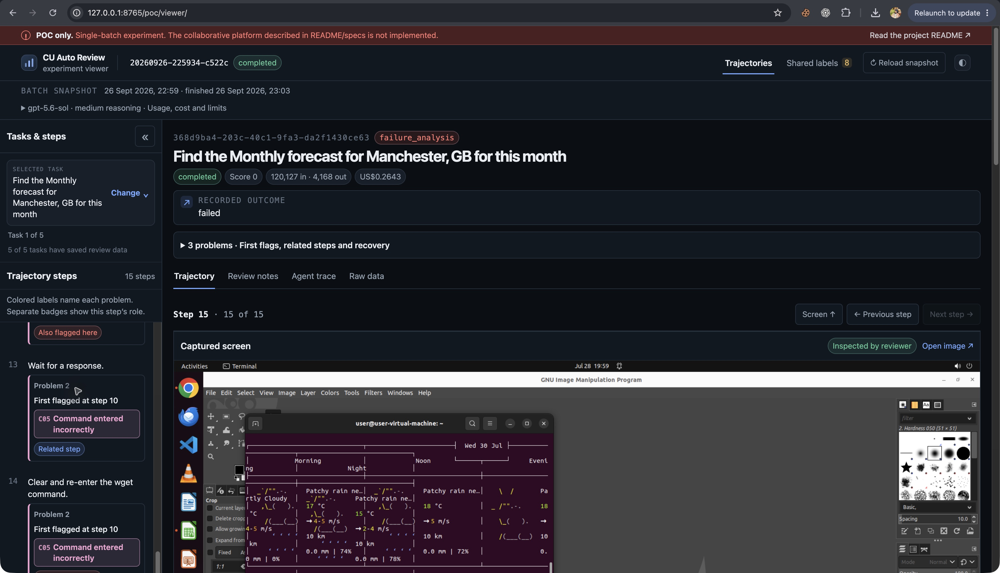
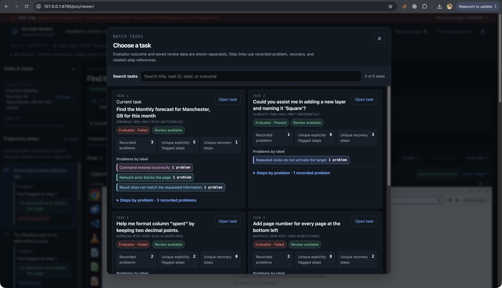
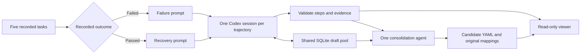

# CUAutoReview local POC

**Five real OSWorld trajectories reviewed end to end.** One small CLI, shared draft labels, a final deduplication agent and a read-only viewer. The [local platform](../platform/README.md) now implements the broader workflow; this original POC remains a separate, preserved experiment.

- **Latest result:** five completed reviews, 69 step annotations, 11 episodes and eight draft labels, 212 seconds wall time. Sparse images leave 48 steps marked insufficient evidence.
- **Model:** `gpt-5.6-sol` at medium reasoning through Codex and the existing ChatGPT login. A fresh GPT-6 Sol probe was rejected; the requested Sol fallback worked.
- **Cost:** the successful five-task Luna and Sol runs cost **$0.040028** and **$0.983911 API-equivalent**, respectively. The table below breaks out five reviewer sessions and the final consolidator. These are not ChatGPT invoices.
- The POC runs locally and retains its experiment artifacts in this folder. Model inference is hosted; running a new review sends the selected public task evidence to Codex. Viewing saved results makes no inference calls.

## View the saved run

No inference is needed to inspect the existing results:

```bash
# From the repository root, using Python 3.10+:
python3 -m venv poc/.venv
poc/.venv/bin/python -m pip install -r poc/requirements.txt
poc/.venv/bin/python poc/serve.py
```

Open **http://127.0.0.1:8765/poc/viewer/**. If it is already running, just open the link.



Actual Chrome capture, cropped to omit browser tabs.

### Searchable task-card popup

Search by task name, ID or label, then open a task from its card.

- Cards show **Evaluator · Passed/Failed** or **Outcome not recorded**, separately from **Review available/unavailable**.
- **Recorded problems** count episodes, one episode per problem. **Unique explicitly flagged steps** and **Unique recovery steps** count unique linked source steps, so they use different denominators from problem counts.
- **Problems by label** groups counts of linked problems. The collapsed **Steps by problem · N recorded problems** section opens numbered groups with labeled **First observed**, **First flagged**, **Also flagged** and **Recovery** step links; **Related steps** is a nested collapsed group.
- Missing review or episode data is **Not recorded**, not zero or a confirmed no-issue result.



Actual Chrome capture, cropped to omit browser tabs.

- **Trajectories:** choose a task and step; compare source screenshot/action with reviewer intent, observed UI, effect and assessment.
  - A collapsible task/step sidebar links each label to recorded onset, recovery or `step.episode_refs`. Each linked episode keeps the same task-local problem number across onset, related and recovery groups. The header scrolls away on normal page scroll; screenshots use the full content width with explanations below, and step navigation keeps the selected image aligned. A sticky **Screen ↑** shortcut returns to the selected screenshot.
  - Larger text, plain names, consistently colored category chips and IDs make labels easier to scan. Definitions are always visible inline. Numbered problem groups give each step an independent role; counts reflect linked problems, and a compact summary jumps to the first-observed/first-flagged step or its episode card. Step role, failure category and recovery status remain separate. Missing evidence remains visibly insufficient or inconclusive. See the [viewer feedback log](docs/VIEWER-FEEDBACK.md).
  - A badge distinguishes screenshots supplied to the model from source-only images.
  - **Review notes:** mistakes, recovery, outcome contribution, original/canonical draft labels and uncertainty.
  - **Agent trace / Raw data:** prompts, visible tool events, structured responses and YAML/JSON/JSONL artifacts. Hidden model reasoning is unavailable.
- **Shared labels:** original proposals, version conflicts, canonical mappings and consolidation trace. Candidate labels are pending human review; there is no publish button.
- **Reload snapshot:** reads the latest saved run while preserving the selected task/step. The red banner explains the limited POC scope.

### Viewer acceptance checks

- Search for a task by name, ID and label; confirm evaluator outcome is separate from review availability, recorded problem counts stay distinct from unique flagged and recovery step counts, label groups count linked problems, and labeled step links open the relevant step. Missing review or episode data must read “Not recorded,” not zero confirmed issues.
- Scroll the page and confirm the document header moves away; minimize and restore the combined task/step sidebar.
- Confirm the screenshot spans the available content width and all explanation fields appear below it.
- Confirm each label's definition is visible inline and matches its pinned taxonomy version before interacting with it.
- Confirm category colors and IDs are consistent, original wording is available in the “Recorded label” disclosure, numbered problem groups give steps independent roles, counts reflect linked problems, and multi-problem summaries jump to the first anchor or a separate episode card.
- Confirm only recorded onset, recovery and step episode references receive markers. First-flagged/first-observed badges point to explicit anchors; no intermediate step is classified by interpolation.
- Confirm version 2 episode numbers are stable across onset, related and recovery groups; first-observed anchors resolve to their recorded steps; legacy runs use only explicit onset IDs in source order; and **Screen ↑** returns to the selected screenshot.
- Navigate next/previous through steps and confirm the selected screenshot stays aligned at the same vertical position.
- Remove or omit evidence in a fixture and confirm the result stays insufficient/inconclusive, never “no issue observed.”
- Confirm step role, failure category and recovery status remain separate, and raw model outputs and historical IDs remain unchanged.

## Measured cost and scaling scenarios

Successful-run API-equivalent costs from the saved run records. Five task-review sessions are summed as reviewers; the separate `dedup_usage` record is the final consolidator.

| Model | Five reviewers | One consolidator | Measured five-task total | Mean per task, consolidation amortized | 1,000-task scenario | 10,000-task scenario |
|---|---:|---:|---:|---:|---:|---:|
| GPT-5.6 Luna | $0.038016 | $0.002012 | $0.040028 | $0.008006 | $8.01 | $80.06 |
| GPT-5.6 Sol | $0.924195 | $0.059716 | $0.983911 | $0.196782 | $196.78 | $1,967.82 |

- **Method:** `mean = successful five-task total / 5`; scenarios use `mean × task count`, keeping one consolidation per five tasks and the observed workload/cache share (Luna 68.8%, Sol 74.0%). [Rates and token formula](docs/RESULTS-SOL.md#cost-and-availability).
- **Limits:** five sparse tasks, four failed and one passed. This cannot establish pass-review savings or forecast the proposed 40% failed / 60% passed traffic. Figures are planning scenarios, not invoices, capacity/accuracy forecasts or upper bounds.
- **Excluded:** infrastructure, human review, retries, unreported cache writes, provider changes and larger-context effects. Real costs vary with evidence and cache reuse.
- **Known recorded experiment spend:** about **$1.083 API-equivalent**, including the failed Luna integration attempt and successful preflights. This excludes coding-assistant usage and rejected probes with no usage report. [Luna accounting](docs/RESULTS.md#costs-and-model-availability) and [Sol accounting](docs/RESULTS-SOL.md#cost-and-availability) retain their individual records.

## Problem number and first-observed contract

Agent output version 2 gives each episode a positive `problem_number` and a required `first_observed_step_id`. Numbers run from 1 through N in source-trace order of first observation; ties use episode-array order. The first-observed step must be the earliest explicit onset ID in that source order. The existing `episode_id` and `onset_step_ids` remain in the record. Repeated links to one episode reuse its number; they do not create a new problem or onset. Each related/recovery group shows the first anchor; summary and detail buttons jump to it. The step's `episode_refs` must include each marked onset/recovery episode and may also include evidence-backed related episodes. A related link alone never becomes a new onset.

Illustrative excerpt, not a complete review:

```yaml
schema_version: "2"
episodes:
  - episode_id: "ep1"
    problem_number: 1
    first_observed_step_id: "s12"
    onset_step_ids: ["s12"]
```

For saved legacy runs without a schema version, the viewer preserves the source and derives a display-only **First flagged at step X** link from the earliest explicit `onset_step_ids` entry in source-trace order. If no explicit onset ID exists, it shows no inferred link. Version 2 shows **First observed at step X** from `first_observed_step_id`. The first group is labeled **First flagged here** or **First observed here**; additional explicit onset entries are **Also flagged here** or **Also observed here**. Related and recovery groups keep the same problem number and show the first anchor. No intermediate steps are inferred.

The saved runs remain unversioned legacy output. Version 2 is validated locally for future runs; this UI change does not need a paid rerun.

## Run another bounded experiment

The five-task data and saved results are included. For a fresh environment, use Python 3.10+ and an authenticated Codex CLI; this run used Codex `0.157.0`. Run the commands below from the repository root.

```bash
python3 -m venv poc/.venv
poc/.venv/bin/python -m pip install -r poc/requirements.txt
codex login status

# No model calls: check task count, route eligibility and session bounds.
poc/.venv/bin/python poc/run.py --dry-run

# Hosted calls: use the Sol settings with current prompts and output schema v2.
poc/.venv/bin/python poc/run.py --timeout 300

# Local contract checks only.
poc/.venv/bin/python -m unittest discover -s poc/tests -v
```

| Setting | Default / boundary |
|---|---|
| Review and consolidation models | `--model gpt-5.6-sol --dedup-model gpt-5.6-sol` |
| Reasoning effort | `--reasoning medium`; low and high also supported |
| Tasks | `--limit 5`, accepts 1 to 10; supplied batch contains five |
| Concurrency | `--parallel 3`, maximum five |
| Session timeout | `--timeout 180`, maximum 300 seconds; no automatic retry |
| Images | `--max-images 3` per task, maximum five; all action text retained |
| Shared-label helpers | Eight calls and four proposals per task |
| Budget | Six sessions by default; no hard dollar cap. Multi-turn context is billed repeatedly, sometimes cached |

- A rerun creates a new timestamped directory; earlier runs stay intact. Only a **completed** run replaces `runs/latest/run.json`, which the viewer and platform seed read. Partial runs exit with code 1 and keep their evidence; Ctrl-C stops running model sessions and marks the run `interrupted`. Open any run, including one in progress, with `/poc/viewer/?run=<run-id>`.
- Output that fails validation is stored as `rejected_review` with the reason in `error`; it is never written as `review.json` or counted as recorded problems. A `reviewed` step must cite evidence, `partial`/`recovered` recovery must cite correction steps, and `issues_observed` needs at least one episode.
- Recorded commands and logs use repo-relative (`./`) and home-relative (`~`) paths rather than host-specific absolute paths.
- `--batch path/to/batch.json` accepts the same normalized structure as [data/batch.json](data/batch.json). This POC does not implement generic import adapters or dataset sync.
- [prepare_data.py](prepare_data.py) can rebuild the sample from pinned public ZIP members using HTTP Range requests. It downloads data but makes no inference calls; it is unnecessary for the saved run.
- A different model must be available to this CLI/account. Unknown model pricing stays unpriced; there is no silent model fallback.

## How this slice works



- **Review:** all action text plus three selected frames; one trajectory context, separate prompts for failed/passed outcomes. Every step receives an annotation, including uncertainty when evidence is sparse. Label names use plain language for observable behavior, with concrete inclusion/exclusion boundaries in their definitions. Avoid cryptic noun piles.
- **Share:** reviewers read an initially empty approved taxonomy and the growing draft pool through `list_labels` / `propose_label` MCP tools. SQLite serializes append operations; stale bases are recorded, not overwritten. Reviewers refresh before final output.
- **Consolidate:** freeze the pool after all reviews; another model session maps every proposal to a canonical draft label. Original proposals and findings remain unchanged. This run produces `0.1.0-draft`.
- **Validate:** JSON schemas, ordered step coverage, supplied evidence IDs, recovery references and complete label mappings. The controller serializes validated structures to YAML.
- **Constrain:** reviewer shell/browser/desktop tools are disabled; only label helpers are exposed. Codex runs read-only in temporary run workspaces. Credentials remain in the normal CLI store and are not copied into artifacts.

## Files and deliberate limits

| Location | Purpose |
|---|---|
| `run.py`, `schemas.py`, `label_tools.py` | Bounded execution, validation and concurrent draft sharing |
| `prompts/` | Short system, failure, recovery, shared-label and consolidation prompts |
| `data/source/`, `data/batch.json` | Native traces, selected screenshots, scores, task definitions and provenance |
| `runs/<id>/` | Inputs, prompt hashes, commands, visible events, review YAML/JSON, proposals, candidate and usage |
| `viewer/`, `serve.py` | No-build HTML/CSS/JS viewer and loopback artifact server |

- **POC substitutions:** JSON batch/provider inputs and YAML outputs; local files replace object storage, a Python worker pool replaces RabbitMQ/Celery, SQLite stores draft proposals only. These do not change the [production queue decision](../docs/specs/08-local-deployment-and-queue.md).
- **Deferred:** teams/authentication, ongoing batches, taxonomy approval/feedback UI, durable queue/retries, Docker deployment, LiteLLM/ACP integrations, Jev, adaptive evidence rendering and a task execution harness.
- **Evidence limits:** recorded evaluator scores were not rerun; pinned task definitions may differ from historical checkers. No human gold diagnoses. Three images per task can miss transitions, and label deduplication does not repair an incorrect diagnosis.
- **Next useful experiment:** adjudicate these five cases, then expand to clean passes and diverse recoveries with matched evaluator versions. Compare sparse versus richer evidence before building platform services.
