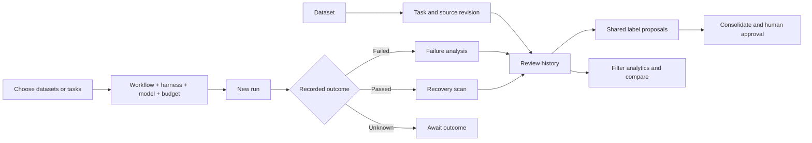

# Runs, navigation and comparison

This refines the platform vocabulary and UX after the local POC. Existing records and the original POC remain intact.

## Mental model

| Item | Meaning | User action |
|---|---|---|
| Dataset | A collection of source tasks and their immutable revisions | Import JSON/ZIP, share, archive, inspect coverage |
| Task | One source trajectory and its evaluator outcome | Inspect source, view all reviews, analyze just this task |
| Run | A bulk review of pinned tasks from one or more datasets | Select all tasks or a subset, configure, start, cancel, run again |
| Review | One analysis result for one task revision in a run | Read step evidence, numbered problems, recovery and feedback |
| Workflow preset | Versioned prompts and stage routing | Inspect the prompt flow before choosing execution |
| Execution settings | Harness, model, reasoning, evidence limits and budget estimate | Pin independently for every new run |

- UI uses **Runs**. Existing `Batch` storage and `/batches` API aliases remain compatible.
- New runs freeze the selected task revisions. Later imports do not silently enter a running experiment.
- Legacy appendable batches retain their explicit sync behavior. A new run is the default for new data or changed settings.
- Dataset and task pages show which runs included them. Task counts distinguish partial selections from full datasets.

## Interaction decisions

- Start always opens configuration. Importing, selecting tasks or opening a draft starts no model work.
- Draft settings may change before any job exists. Started settings stay immutable; run again creates a successor ID with pinned source revisions.
- Cancelling preserves completed evidence. A cancelled run offers **Run again**, which opens configuration.
- Harness availability comes from the worker. Unconfigured adapters stay visible but disabled. Saved replay says it opens an existing diagnosis without new inference.
- Cards use real links, including support for new tabs. Task detail includes breadcrumbs, source, run/review history, downloads and archive/restore.
- Task detail opens a trajectory workspace: steps at the left, the selected step's screenshot and explanation beside them, other runs/reviews below. Select one review or inspect all reviews for that exact source revision. Every problem flag names its run/model; agreement is never inferred by merging flags.
- Model fields are searchable dropdowns from a credential-scoped provider metadata snapshot. List membership is not proof that an inference request will succeed. Changing the harness reloads its compatible list; an unavailable historical model requires an explicit replacement.
- Saved execution presets are shortcuts for harness/model/budget settings. Prompts remain in the independently versioned workflow. The UI shows stage instructions and explains that shared evidence rules and the output schema are added.
- Hosted presets start with a positive planning allowance, using known token prices when available. Otherwise show a clearly labelled $0.10 starting allowance. Saved replay is free and is labelled as such. CLI allowances are not hard provider billing caps.
- The configured hosted task allowance applies to each attempt. A job permits an initial attempt plus up to three automatic retries for retryable failures. The planned allowance includes the maximum attempts, so it can be up to four times the per-attempt amount for each reviewable task. A retry can repeat a billable call after a response was lost or unusable; provider-internal reconnects are outside the application's retry count. This remains a planning estimate, not a hard provider spending limit.
- Full-screen selectors have cards, search, counts, select all shown, clear and partial dataset selection. Cancel discards selector edits.
- Share datasets with named users, teams or workspace viewers. Run grants can add users and teams; names/emails are searchable. Revocation applies at read time.
- Buttons keep icon and label together. Missing screenshots show an explicit compact state, never a nearby frame presented as the selected step.
- Use compact aligned flag fields: problem number, self-explanatory label, relation to the first step, review and model. Colour reinforces status; it does not replace text. Avoid long sentences inside pill badges.
- On phones, use a navigation drawer and full-screen step picker; keep evidence full width and controls reachable. Cards stack, metadata wraps and tables scroll inside their own container. Use restrained type sizes and preserve touch targets.
- A navigation card's full body is a real link with visible keyboard focus. Checkboxes, disclosure controls, job links and other secondary actions remain independent; selection cards toggle once without starting work.

## Analytics and comparison

- OR within each selected group, AND across datasets/runs/tasks. Empty group means all accessible records. Archives are excluded by default.
- Display applied filters by name; preserve filters in the URL. Show matched task count, run appearances, completed reviews, problem episodes, recovery references and evidence gaps.
- A task reviewed twice contributes two review rows. Episode frequency across reviews is not unique-task failure prevalence or measured review accuracy.
- Run task totals, evaluator-outcome totals, processing-state totals, saved/missing review counts, and invocation attempt/retry counts describe separate facts with different denominators. Source outcome is not processing success, and a completed job does not establish a correct review.
- Source evaluator outcome and reviewer execution status are separate. Missing costs stay unknown; pricing estimates are not invoices.
- A run with terminal failed jobs says **Finished with errors**, even at 100% finished. Dataset summaries, task history, runs and analytics use compatible status meanings.
- Compare only the same task definition and source revision. Preserve model, harness, timestamps, coverage and each full review.
- Align steps by source step ID. Different wording or labels is a review difference, not proof of error or a winning model.
- Human disagreement notes reference both result IDs and append feedback to both histories. A failed second write can be retried without repeating the successful first write.

## Demo and evidence

- Three demo datasets contain eight distinct public OSWorld task IDs: Office 3, Web 3, Graphics 2. See [source manifest](../platform/demo-data/manifest.json).
- Original acceptance fixtures are soft-archived from normal lists. Their results remain available through **Show archived**.
- Raw source scores and screenshot association are preserved. Historical task/evaluator equivalence and human failure labels are not assumed.
- Live checks and provider limits belong in [platform test evidence](../platform/TEST-RESULTS.md), not in a feature promise.
